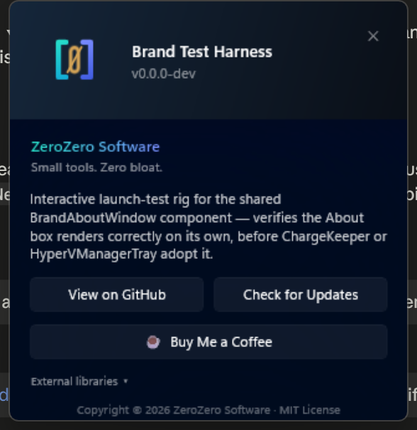

# ZeroZero Software — shared branding library

Shared visual identity and About-window plumbing for ZeroZero Software's desktop apps
(currently [ChargeKeeper](https://github.com/0z00z0/ChargeKeeper) and
[HyperVManagerTray](https://github.com/0z00z0/HyperVManagerTray)). Both apps shipped
near-identical, hand-copied `AboutWindow.xaml` popups that had started to drift; this repo
unifies them into one parameterized component and centralizes the studio's brand constants
(name, tagline, palette, links) so future apps don't have to re-type them.

MIT licensed, public.

## Projects

### `src/ZeroZero.Brand.Core`

Plain `net10.0` — no WinUI, no Windows-specific dependencies, safe to reference from a console
app or any other .NET target. Contains:

- **`Brand.cs`** — studio-wide constants: name, tagline, website, Buy Me a Coffee URL, GitHub org
  URL, and the brand palette as hex strings (teal / blue / purple / indigo / amber, plus the two
  background tones).
- **`ExternalLibrary.cs`** — a small record describing a third-party dependency to credit
  (name, author, purpose, license, optional URL).
- **`AboutInfo.cs`** — the per-app data an About surface needs: app name, version, description,
  repo URL, and its list of `ExternalLibrary` credits.
- **`ConsoleBanner.cs`** — prints a plain-ASCII "about" banner to the console for non-UI (CLI)
  tools, built from an `AboutInfo`.

### `src/ZeroZero.Brand.WinUI`

`net10.0-windows10.0.26100.0`, WinUI 3 / Windows App SDK, unpackaged. References
`ZeroZero.Brand.Core`. Contains:

- **`BrandAboutWindow`** — the shared, parameterized About popup (320px wide, Mica backdrop,
  centered on the monitor under the cursor, no title bar, always-on-top). Replaces each app's own
  hand-rolled `AboutWindow`. Carries its own minimal Win32 P/Invoke for monitor/DPI metrics, so it
  has no dependency on a consuming app's own `NativeMethods` class.
- **`BrandAboutOptions`** — the parameters: an `AboutInfo`, an optional `OnCheckForUpdates`
  callback (omit it to hide the "Check for Updates" button entirely — a console-only tool or a
  build without an update channel just doesn't pass one), and an optional `OnBeforeExit` hook for
  apps that need to self-exit cleanly before an installer-triggered relaunch.

Deliberately **not** shared: each app's own update-check networking/dialog plumbing
(`UpdateCheckService`, `UpdateChecker`, `UpdatePrompt`, etc.). Only the window chrome and layout
are unified — `OnCheckForUpdates` is a plain `Func<Task>` the consumer wires up to its own
existing update flow.

### `src/ZeroZero.Brand.WinUI.TestHarness`

A minimal WinUI exe that launches `BrandAboutWindow` directly with this repo's own sample data —
run it to eyeball the About box on screen without building or running ChargeKeeper or
HyperVManagerTray:

```powershell
dotnet run --project src/ZeroZero.Brand.WinUI.TestHarness
```

## Screenshot



*Updated from the test harness whenever the window is visually verified — always reflects the
current on-screen appearance, not just what the XAML claims.*

## How consumers reference this

Both consumers are plain `ProjectReference`s (no NuGet feed yet):

```xml
<ProjectReference Include="..\ZeroZeroBrand\src\ZeroZero.Brand.WinUI\ZeroZero.Brand.WinUI.csproj" />
```

(`ZeroZero.Brand.WinUI` already references `ZeroZero.Brand.Core` transitively.)

Construct the window with data only — no per-app XAML or logic duplication:

```csharp
var options = new BrandAboutOptions
{
    Info = new AboutInfo
    {
        AppName           = "YourApp",
        Version           = "1.2.3",
        Description       = "What your app does.",
        RepoUrl           = "https://github.com/0z00z0/YourApp",
        ExternalLibraries = [ new ExternalLibrary("SomeLib", "Some Author", "What it's for", "MIT", "https://...") ],
    },
    OnCheckForUpdates = async () => await YourApp.Services.UpdateCheckService.CheckNowAsync(...),
    OnBeforeExit      = () => _onExit(), // optional
};

var about = new BrandAboutWindow(options);
about.Activate();
```

## Package versions

`Microsoft.WindowsAppSDK` and `Microsoft.Windows.SDK.BuildTools` versions are pinned to match
what ChargeKeeper and HyperVManagerTray already use (`2.1.3` / `10.0.28000.1839` at the time of
writing) so all three projects resolve the same Windows App SDK runtime.

## Build

```powershell
dotnet build ZeroZeroBrand.slnx
```

## License

[MIT](LICENSE) © ZeroZero Software ([0z0.xyz](https://0z0.xyz))
