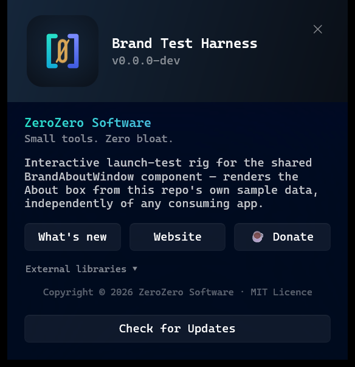
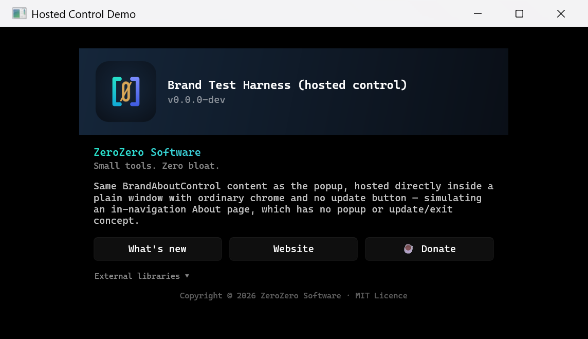
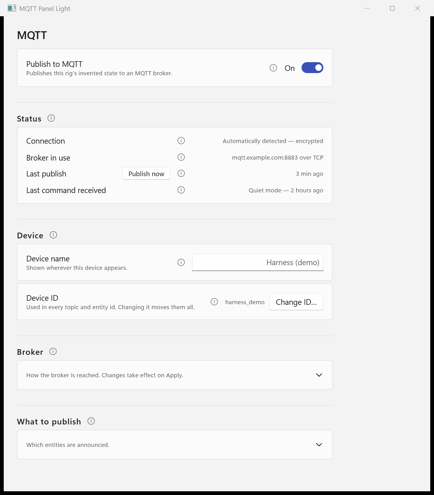
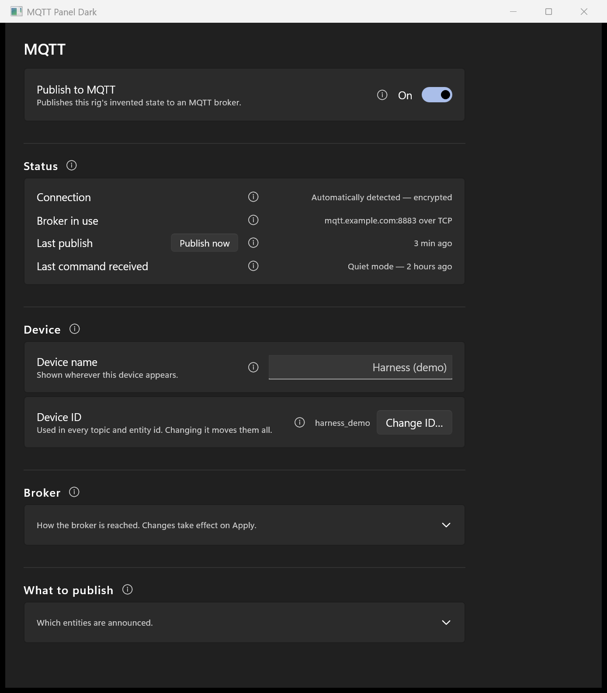
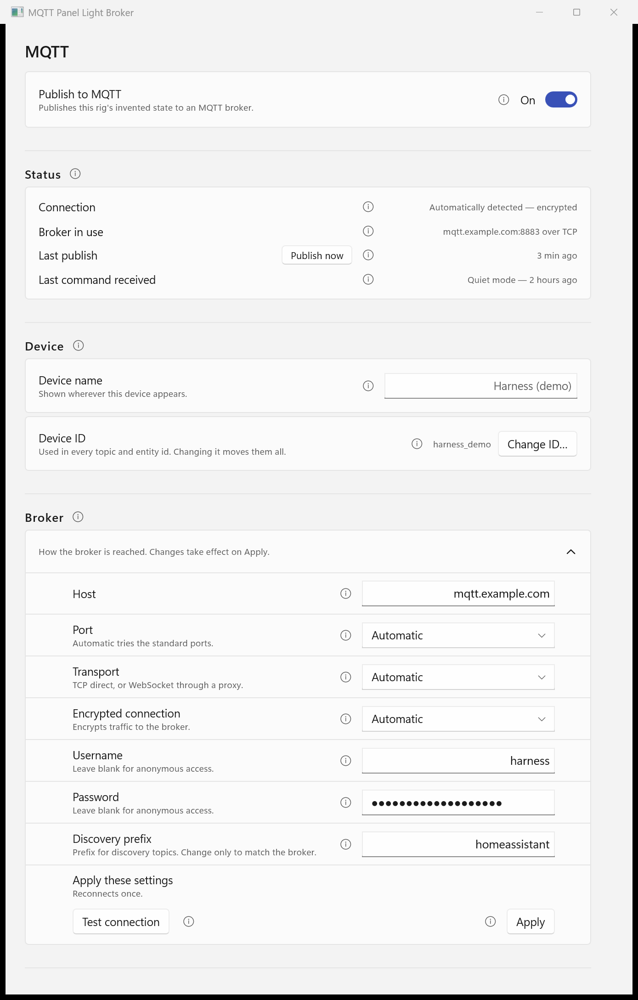
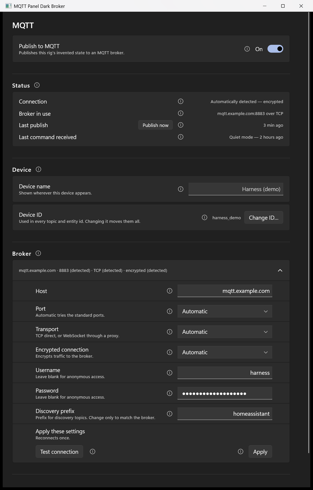
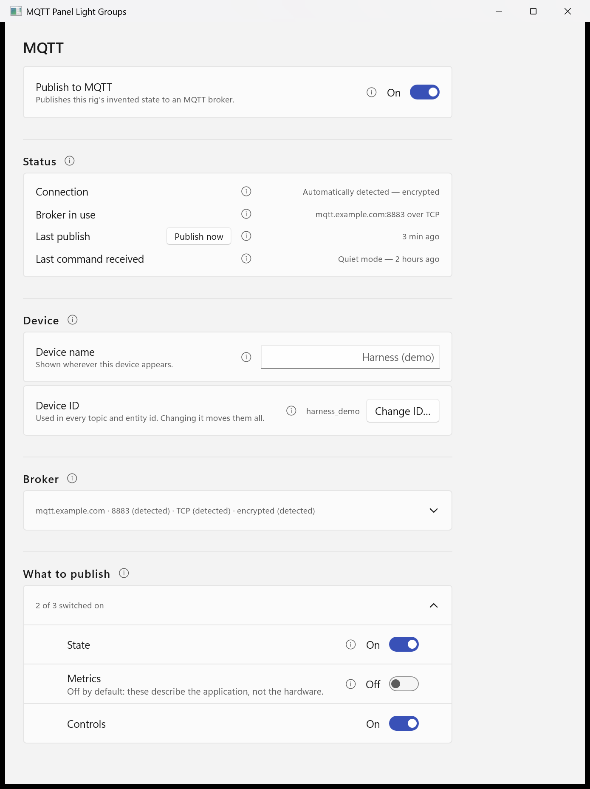
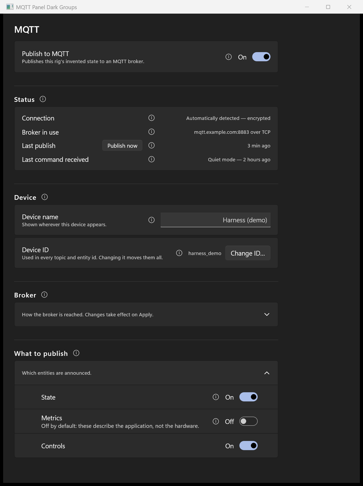
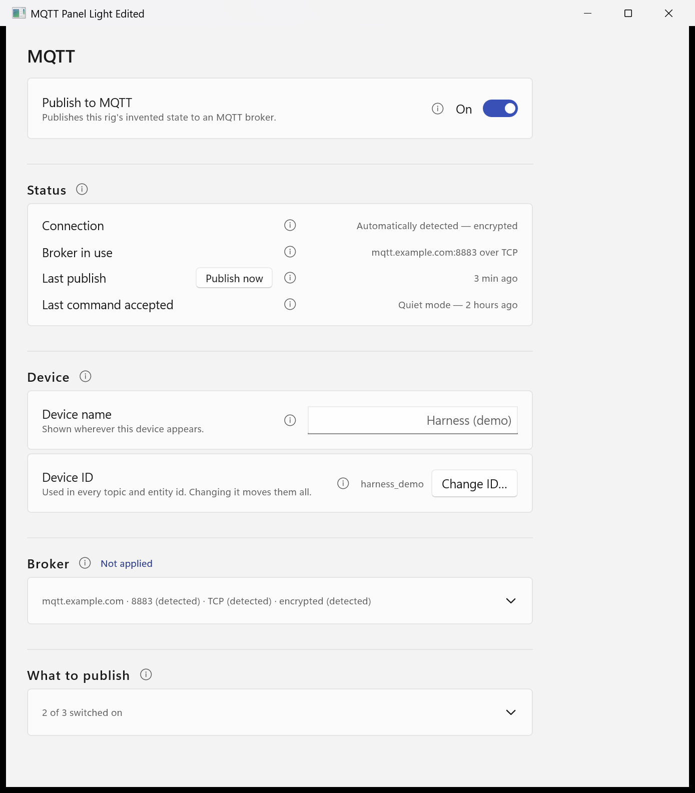
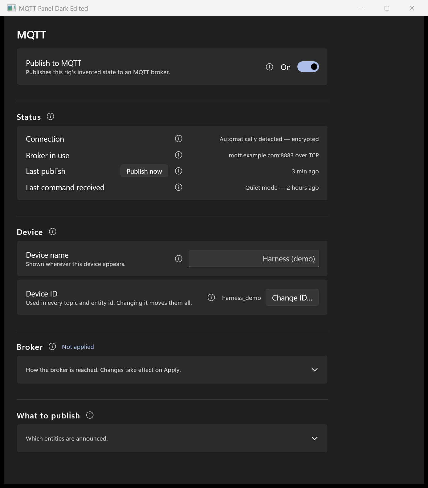

# ZeroZero Software — shared library

The building blocks ZeroZero Software's desktop apps share (currently
[ChargeKeeper](https://github.com/0z00z0/ChargeKeeper) and
[HyperVManagerTray](https://github.com/0z00z0/HyperVManagerTray)), so no app re-types them. Seven
projects in two modules:

- **The brand module** — the studio's visual identity and About plumbing: the brand constants
  (name, tagline, palette, links), one parameterised About component, and the settings-row info
  icon. `ZeroZero.Brand.Core` and `ZeroZero.Brand.WinUI`.
- **The MQTT module** — atomic JSON settings, an MQTT 5.0 connection, and above it a device
  document that puts the application into a discovery-aware receiver as one device with entities,
  plus the settings panel a host embeds. `ZeroZero.Config`, `ZeroZero.Mqtt`,
  `ZeroZero.Mqtt.Discovery` and `ZeroZero.Mqtt.WinUI`, with
  [`docs/zerozero-mqtt.md`](docs/zerozero-mqtt.md) as its implementation guide.

`ZeroZero.Brand.WinUI.TestHarness` is an interactive exe that opens either surface on screen.

Third-party packages are the Windows App SDK, the Community Toolkit's settings controls, and
**MQTTnet** — the last confined to `ZeroZero.Mqtt`, where no MQTTnet type reaches a public
signature. `ZeroZero.Brand.Core` and `ZeroZero.Config` reference nothing at all.

MIT licensed, public.

## Getting started

```powershell
git clone https://github.com/0z00z0/0z0-shared.git
```

Consuming apps reference this repo by relative path, so it is cloned as a **sibling** of the
consuming app's own checkout — `..\0z0-shared` from the consumer's project directory. See
[Integrating the About dialogue](#integrating-the-about-dialogue) for the reference and CI recipe,
which is the same one for either module; [`docs/zerozero-mqtt.md`](docs/zerozero-mqtt.md) carries
the MQTT module's wiring on top of it.

Requirements:

- **.NET 10 SDK.**
- **Windows 10 1809 (build 10.0.17763) or later**, with the Windows App SDK. The Windows App SDK
  and SDK build tools arrive as NuGet packages, so `dotnet restore` is enough.

Three projects target `net10.0-windows10.0.26100.0` — `ZeroZero.Brand.WinUI`, `ZeroZero.Mqtt.WinUI`
and the test harness — so the solution builds on Windows only. The other four,
`ZeroZero.Brand.Core`, `ZeroZero.Config`, `ZeroZero.Mqtt` and `ZeroZero.Mqtt.Discovery`, are plain
`net10.0` and portable in isolation, as are all four test projects. The MQTT module additionally
needs an MQTT 5.0 broker at run time, and Home Assistant 2024.11.0 or later for discovery.

## Projects

### `src/ZeroZero.Brand.Core`

Plain `net10.0` — no WinUI, no Windows-specific dependencies, safe to reference from a console
app or any other .NET target. Contains:

- **`Brand.cs`** — studio-wide constants: name, tagline, website, Buy Me a Coffee URL, GitHub org
  URL, and the brand palette as hex strings (teal / blue / purple / indigo / amber, plus the two
  background tones).
- **`ExternalLibrary.cs`** — a small record describing a third-party dependency to credit
  (name, author, purpose, licence, optional URL).
- **`AboutInfo.cs`** — the per-app data an About surface needs: app name, version, description,
  repo URL, and its list of `ExternalLibrary` credits.
- **`ConsoleBanner.cs`** — prints a plain-ASCII "about" banner to the console for non-UI (CLI)
  tools, built from an `AboutInfo`.

### `src/ZeroZero.Brand.WinUI`

`net10.0-windows10.0.26100.0`, WinUI 3 / Windows App SDK, unpackaged. References
`ZeroZero.Brand.Core`. Contains:

- **`BrandAboutControl`** — a `UserControl` holding the actual About *content*: the `[Ø]` studio
  mark + brand header band, the company name and tagline as plain non-interactive text, app
  description, three co-equal link buttons (repository / website / donate), an expandable
  external-libraries credit list, and a copyright footer. Owns no window chrome, sizing, or update/exit flow — hosts
  either inside `BrandAboutWindow` (tray-app popup) or directly inside a host app's own
  in-navigation page (a full windowed app with no separate About window and no update concept).
  Call `SetInfo(AboutInfo)` after construction to populate it (a method, not a settable property —
  the WinUI XAML compiler needs a parameterless constructor for any type exposed as a public
  property on a XAML class, which `AboutInfo`'s `required` members deliberately don't have).
- **`BrandAboutWindow`** — the shared, parameterised About popup (320px wide, Mica backdrop,
  centred on the monitor under the cursor, no title bar, always-on-top). A thin shell hosting
  `BrandAboutControl` plus the tray-app-only "Check for Updates" button. Carries its own minimal
  Win32 P/Invoke for monitor/DPI metrics, so it has no dependency on a consuming app's own
  `NativeMethods` class.
- **`BrandAboutOptions`** — the parameters: an `AboutInfo`, an optional `OnCheckForUpdates`
  callback (omit it to hide the "Check for Updates" button entirely — a console-only tool or a
  build without an update channel just doesn't pass one), and an optional `OnBeforeExit` hook for
  apps that need to self-exit cleanly before an installer-triggered relaunch.
- **`InfoIcon`** — a small "(i)" button that opens its explanation in a flyout, for the settings row
  whose how-it-works detail would otherwise sit in the visible copy. `Info`, `Subject` and
  `GlyphCode` are dependency properties, so a row built in code can bind them.
  `ZeroZero.Mqtt.WinUI` uses it, and it carries no MQTT vocabulary.

Deliberately **not** shared: each app's own update-check networking/dialogue plumbing
(`UpdateCheckService`, `UpdateChecker`, `UpdatePrompt`, etc.). Only the window chrome and layout
are unified — `OnCheckForUpdates` is a plain `Func<Task<bool>>` the consumer wires up to its own
existing update flow (returning `true` when an update was applied so the window owns the
clean-exit-before-relaunch step via `OnBeforeExit`).

### `src/ZeroZero.Config`

Plain `net10.0`, no package references — the settings store the MQTT module reads and writes, and
usable on its own by anything that keeps a JSON document on disk. Contains:

- **`SettingsFile<T>`** — an atomic JSON file: a typed snapshot read, mutation under one lock, a
  write that lands whole or not at all, and a change event. The snapshot is what callers hold, so a
  reader never observes a half-applied edit.
- **`SettingsFileOptions`** — where the file lives, how it serialises, and what to do on failure.
- **`SettingsFileQuarantine`** — what happens to a file that cannot be parsed: it is moved aside
  rather than overwritten, so a corrupt document is recoverable instead of silently replaced by
  defaults.
- **`SettingsSaveFailedEventArgs`** and `SettingsSaveResult` — a failed write is reported, never
  swallowed.

### `src/ZeroZero.Mqtt`

Plain `net10.0`, references `ZeroZero.Config` and **MQTTnet** — the repository's one third-party
protocol dependency, and the reason this is a project of its own rather than an addition to
`ZeroZero.Brand.Core`'s zero-dependency rule. No MQTTnet type reaches a public signature: the
module's own `MqttQos`, `MqttConnackCode` and `MqttPubackCode` stand in front of it. This layer is
protocol-only and names no entity, sensor or device class. Contains:

- **`MqttConnection`** — the connection engine: connect, transport sweep, backoff with flap
  escalation, publish and subscribe, QoS, retain, the Last Will, and a bounded dispose. `Apply` is
  idempotent, so applying on every settings change costs nothing.
- **`MqttChannel`** / **`MqttChannelSet`** — a topic key plus a payload provider, with a debounce,
  a dedupe and a retain policy. It publishes whatever string its provider returns.
- **`MqttCommandTarget`** / **`MqttCommandRouter`** — an entity id and the handler an inbound
  payload reaches, with a refusal reported rather than swallowed.
- **`MqttSettings`**, **`MqttSettingsFile`**, **`IMqttSettingsStore`** — the configuration record,
  a file-backed store over `ZeroZero.Config`, and the interface a host implements over its own
  document instead.
- **`MqttProbe`**, **`MqttEndpoint`**, **`MqttEndpointPlan`**, **`MqttCertificateTrust`** — endpoint
  search within a caller-supplied budget, the three encryption modes, and the trust decision that
  governs whether an automatic downgrade is allowed.
- **`PublishGroup`** / **`PublishGroupSet`** — the host-declared publish groups whose state persists
  per key, never per index.
- **`MqttStrings`**, **`MqttPanelText`**, **`MqttStatusText`** — the module's built-in en-GB wording,
  which is what the panel falls back to.

### `src/ZeroZero.Mqtt.Discovery`

Plain `net10.0`, references `ZeroZero.Mqtt` and `ZeroZero.Config` — WinUI-free, so an entity table
composes in a plain `net10.0` test project with no broker and no desktop present. Everything the
receiver's specification owns rather than MQTT's. Contains:

- **`MqttEntity`** and the seven component types — `MqttSensor`, `MqttBinarySensor`, `MqttSwitch`,
  `MqttButton`, `MqttNumber`, `MqttSelect`, `MqttText`. One declaration per entity carries its
  discovery keys, its reader and, where it is writable, what an inbound payload does. Bounds are
  declared once and enforced twice — the receiver's control and `Accept` both hold to them.
- **`MqttEntitySet`** — the declared table, read on every announcement pass.
- **`DiscoveryDocument`**, **`DiscoveryDevice`**, **`DiscoveryTopics`** — one retained device
  document at `<prefix>/device/<deviceId>/config`, with root-level availability every component
  inherits, and one bare topic per entity carrying a plain value.
- **`DiscoveryPublisher`** / **`DiscoveryPublisherSetup`** — the announcement pass: what to publish,
  what to withhold, and what to evict.
- **`DiscoveryLedger`**, **`DiscoveryLedgerFile`**, **`IDiscoveryLedgerStore`** — the record of what
  was last announced, so eviction survives a process restart rather than depending on what happens
  to be declared now.

### `src/ZeroZero.Mqtt.WinUI`

`net10.0-windows10.0.26100.0`, WinUI 3 / Windows App SDK, unpackaged. References `ZeroZero.Mqtt`
for the protocol module, `ZeroZero.Brand.WinUI` for `InfoIcon`, and `ZeroZero.Mqtt.Discovery` so
that one reference on this project delivers the whole module. Contains:

- **`MqttSettingsPanel`** — the settings page for the MQTT module: a master switch, a live status
  block, the device identity, a staged broker block behind an Apply, and one row per
  application-declared publish group. The panel renders the structure and knows no application's
  subject matter; everything domain-shaped arrives through `MqttPanelSetup` and every edit reports
  back as a callback.
- **`MqttPanelSetup`** — everything the panel needs from its host, in one object initialiser.
- **`MqttResourceStrings`** — the module's own `.resw`, read through the Windows App SDK's
  `ResourceManager` and the `ResourceMap`s below it, with the built-in en-GB in `MqttStrings` as
  the floor. Several maps are tried, because where a library's strings land in the index depends on
  how the consuming application builds; a key none of them answers falls back to the built-in text.
- **`Themes/MqttPanelResources.xaml`** — six theme keys a host may override — five brushes and a
  font family — defaulting to the stock WinUI theme.

[`docs/zerozero-mqtt.md`](docs/zerozero-mqtt.md) is the implementation guide for the whole module —
the six assemblies, the six wiring steps, the entity model, identity, the encryption model and the
panel. [`consume-mqtt-settings-panel.md`](consume-mqtt-settings-panel.md) is the shorter adoption
checklist for the panel alone.

### `src/ZeroZero.Brand.WinUI.TestHarness`

A minimal WinUI exe that opens both hosting scenarios with this repo's own sample data — run it to
eyeball the About content on screen without building or running ChargeKeeper, HyperVManagerTray, or
M365Migrator:

```powershell
dotnet run --project src/ZeroZero.Brand.WinUI.TestHarness
```

It opens two windows: the `BrandAboutWindow` popup ("Window Mode") and a plain window hosting
`BrandAboutControl` directly with ordinary title-bar chrome and no update button ("Hosted Control
Demo") — simulating a full windowed app's in-navigation About page.

#### Scripts

Three PowerShell scripts in the repo root drive that harness:

- **`Show live 'About' dialogue.ps1`** — builds the harness if its exe is missing, then launches
  it, so both windows can be inspected on screen.
- **`Capture 'About' screenshot.ps1`** — launches the harness and writes window-only PNGs of both
  scenarios into `docs/screenshots/`: `about-window.png` (the popup) and `about-hosted-control.png`
  (the hosted control), the two images this README embeds. Capture goes through `PrintWindow` with
  `PW_RENDERFULLCONTENT`, so the translucent Mica backdrop resolves cleanly and no desktop content
  bleeds through; the two windows are told apart by their `AppWindow` title, not creation order.
- **`Capture 'MQTT panel' screenshots.ps1`** — launches the harness with `--mqtt` and writes the
  eight panel PNGs: each theme as the panel opens, with the Broker group open, with the publish list
  open, and holding an unapplied edit. It holds the display awake and checks the desktop is
  composing first, because DWM composes nothing while the display is off and a capture taken then is
  uniformly black.

The harness takes `--mqtt` to open the MQTT panel scenario instead of the About windows: one
component per run, so unrelated windows never land on top of each other.

## Screenshots

**`BrandAboutWindow`** (tray-app popup):



**`BrandAboutControl`** hosted directly in a plain window (no popup chrome, no update button):



**`MqttSettingsPanel`**, as it opens (light and dark):

| Light | Dark |
|---|---|
|  |  |

With the Broker group open:

| Light | Dark |
|---|---|
|  |  |

With the publish list open:

| Light | Dark |
|---|---|
|  |  |

An unapplied broker edit is marked beside the section heading, so a closed group cannot hide it:

| Light | Dark |
|---|---|
|  |  |

All ten images are the capture scripts' output — every PNG those scripts write is embedded here — so
they show the surfaces as they actually render rather than what the XAML claims.

## Integrating the About dialogue

### 1. Reference the library

There is no NuGet feed yet — tracked in
[issue #14](https://github.com/0z00z0/0z0-shared/issues/14) — so a consumer takes a
`ProjectReference` on a checkout of this repo. Route it through an MSBuild property that defaults
to the sibling folder, so CI can point the same reference somewhere else without editing the
`.csproj`:

```xml
<PropertyGroup>
  <ZeroZeroSharedDir Condition="'$(ZeroZeroSharedDir)' == ''">..\0z0-shared</ZeroZeroSharedDir>
</PropertyGroup>

<ItemGroup>
  <ProjectReference Include="$(ZeroZeroSharedDir)\src\ZeroZero.Brand.WinUI\ZeroZero.Brand.WinUI.csproj">
    <UndefineProperties>WindowsAppSDKSelfContained</UndefineProperties>
  </ProjectReference>
</ItemGroup>
```

`UndefineProperties="WindowsAppSDKSelfContained"` is required whenever the consuming app publishes
self-contained with that property set globally (on the command line, for instance): MSBuild
propagates a global property into every project reference, and the Windows App SDK targets reject
it on a class library — *"should not be applied to a class library"*. Stripping it for this
reference only lets the app aggregate the self-contained runtime while the library builds
framework-dependent. An app that instead declares `WindowsAppSDKSelfContained` as a project-level
property never propagates it and does not need the metadata.

`ZeroZero.Brand.WinUI` pulls in `ZeroZero.Brand.Core` transitively and ships the brand typeface
(Cascadia Mono) as content, so a consumer gets the correct font with no extra setup. The consuming
app's `app.manifest` declares `PerMonitorV2` DPI awareness (as ChargeKeeper and HyperVManagerTray
do) so the window renders sharp on high-DPI displays.

### 2. Make the reference resolve in CI

A GitHub Actions runner checks out one repo, so the consumer's workflow has to fetch this one as
well. Two working shapes, both in use:

**Workspace subfolder + property override.** `actions/checkout` refuses a `path:` outside the
workspace, so the second checkout lands *inside* it and the `ZeroZeroSharedDir` property is
redirected there through job-level `env` (MSBuild reads environment variables as properties):

```yaml
jobs:
  build-test:
    runs-on: windows-latest
    env:
      ZeroZeroSharedDir: ${{ github.workspace }}/0z0-shared
    steps:
      - uses: actions/checkout@v7
      - uses: actions/checkout@v7
        with:
          repository: 0z00z0/0z0-shared
          path: 0z0-shared
```

The checkout then sits under the consuming project's own directory, where the SDK's default globs
would compile this repo's sources into the consuming assembly on top of the `ProjectReference` —
duplicate types and an ambiguous `NativeMethods`. Exclude the folder from the consuming project's
item globs:

```xml
<ItemGroup>
  <Compile               Remove="0z0-shared\**\*" />
  <Content               Remove="0z0-shared\**\*" />
  <None                  Remove="0z0-shared\**\*" />
  <Page                  Remove="0z0-shared\**\*" />
  <ApplicationDefinition Remove="0z0-shared\**\*" />
  <EmbeddedResource      Remove="0z0-shared\**\*" />
</ItemGroup>
```

That matches nothing locally, where the repo is an outside-the-tree sibling.

**Clone to a real sibling.** The alternative keeps the relative path identical to local dev by
cloning (this repo is public, so no token is needed) beside the workspace checkout, and is what a
pinned build wants because `checkout --detach` takes an exact ref:

```yaml
      - name: Clone 0z0-shared (sibling dependency, pinned)
        shell: pwsh
        run: |
          git clone https://github.com/0z00z0/0z0-shared.git ../0z0-shared
          git -C ../0z0-shared checkout --detach $ref
```

### 3. Pin a tag

Every consumer-visible change is released under a `v`-prefixed tag — `v0.1.0`, `v0.2.0`, `v0.2.1`,
`v0.3.0`, `v0.3.1` — and **a tag is the ref to pin, not a raw commit SHA.** A tag reads as a version,
so a pin bump is a legible diff and a reviewable decision; a SHA says only that something moved. Each
tag carries
release notes listing what changed, so **a consumer raising its pin reads the notes for that tag
first** — the breaking changes are stated there, and there is no other place they are collected.

The scheme is [semantic versioning](https://semver.org) and the library is **pre-1.0**: while the
major stays `0`, a **minor** bump may break the API and a **patch** never does. Tags are cut on a
consumer-visible change, not on a calendar — the API, or the guidance a consumer builds against,
since a correction to the guides only reaches a consumer that pins tags when there is a tag carrying
it. The version is declared once, in `Directory.Build.props`, and every assembly in the
repository reports it; the release workflow refuses to publish a tag that disagrees with it.

Both CI shapes above take a tag wherever they take a SHA. The **workspace subfolder** shape passes
it as the second checkout's `ref`:

```yaml
      - uses: actions/checkout@v7
        with:
          repository: 0z00z0/0z0-shared
          path: 0z0-shared
          ref: v0.3.1
```

The **sibling clone** shape needs no change at all — a full `git clone` fetches tags, so
`checkout --detach $ref` resolves one. Shallow is the one thing to watch: `--depth 1` alone leaves
no tag to check out, so it comes with `--branch v0.3.1`.

Local dev builds against the live sibling checkout while CI builds the pinned tag, so a consumer
that adopts a newly added shared type builds green locally and fails CI with `CS0234`. A consumer
that wants reproducible builds therefore keeps two things: a **pinned-ref file** read by every
workflow that clones this repo (one file, so the pins cannot drift between CI and release), and a
**build-time drift guard** — an MSBuild target that compares the live sibling checkout against that
file and raises a warning, never an error, and skips entirely when either the ref file or the
sibling clone is absent. ChargeKeeper's `.github/0z0-shared-ref` plus its `CheckSharedPin` target
and `scripts/check-shared-pin.ps1` are the working example. Put the tag in that file rather than
the SHA it resolves to, and let the guard resolve it — the pin is then readable where it is edited.

There is no NuGet feed to pin instead. Neither WinUI assembly can be packed —
`ZeroZero.Brand.WinUI` and `ZeroZero.Mqtt.WinUI` both compile XAML to binary form, and
`ZeroZero.Mqtt.WinUI` additionally indexes a `.resw` into a `.pri`; `dotnet pack` carries none of it
— so a release is the tag and its notes, which is all a `ProjectReference` on a pinned checkout
needs.

### 4. Pick the hosting style

Both share the same `AboutInfo` data model — the choice is whether the consuming app has a separate
About *window* or an About *page*:

| | Tray/systray apps | Full windowed apps |
|---|---|---|
| Component | `BrandAboutWindow` | `BrandAboutControl` |
| Surface | Standalone popup (Mica, no title bar, always-on-top) | Hosted inside the app's own `Page`/window |
| "Check for Updates" | Yes, via `BrandAboutOptions` | No — not this layer's concern |
| Used by | ChargeKeeper, HyperVManagerTray | (candidate: M365Migrator) |

### Option A — Tray app popup (`BrandAboutWindow`)

Open the window with data only — no per-app XAML or logic duplication:

```csharp
var options = new BrandAboutOptions
{
    Info = new AboutInfo
    {
        AppName           = "ExampleApp",
        Version           = "1.2.3",
        Description       = "What the app does.",
        RepoUrl           = "https://github.com/0z00z0/ExampleApp",
        ExternalLibraries = [ new ExternalLibrary("SomeLib", "Some Author", "What it's for", "MIT", "https://...") ],
    },
    OnCheckForUpdates = async () => await ExampleApp.Services.UpdateCheckService.CheckNowAsync(...),
    OnBeforeExit      = async () => { await ExampleApp.ShutdownAsync(); return true; },
};

new BrandAboutWindow(options).Activate();
```

**The update-check contract** — both callbacks are optional:

- **`OnCheckForUpdates`** (`Func<Task<bool>>`) — wired to the consuming app's own update flow.
  Return `true` when an update was applied and the window drives the clean exit (so the installer
  can relaunch); return `false` when there was nothing to update and the window stays open.
  **Omit it entirely to hide the "Check for Updates" button** — e.g. a console-only tool or a build
  with no update channel.
- **`OnBeforeExit`** (`Func<Task<bool>>`) — run just before an update-triggered close so the app
  can tear down cleanly; return `false` to veto the exit and keep the window open.

The window owns only chrome and layout; each app keeps its own update-check networking/dialogue
plumbing and wires it in through these two callbacks.

### Option B — Hosted in the app's own page (`BrandAboutControl`)

A full windowed app whose About is an in-navigation `Page` (not a separate popup, and with no
"check for updates" concept) skips `BrandAboutWindow` entirely and hosts the content control itself.

**1. Add the control to the app's existing About page XAML**, in place of the bespoke layout:

```xml
<!-- The consuming app's own AboutPage.xaml -->
<Page ... xmlns:brand="using:ZeroZero.Brand.WinUI">
    <ScrollViewer>
        <brand:BrandAboutControl x:Name="About" MaxWidth="560" HorizontalAlignment="Center"/>
    </ScrollViewer>
</Page>
```

**2. Populate it from the app's existing brand-facts source** (whatever plays the same role as this
repo's `AboutInfo` — e.g. a `BrandInfo` static class that also feeds a CLI banner):

```csharp
// AboutPage.xaml.cs
public AboutPage()
{
    InitializeComponent();
    About.SetInfo(new AboutInfo
    {
        AppName           = AppBrandInfo.Product,
        Version           = AppBrandInfo.Version,
        Description       = AppBrandInfo.Description,
        RepoUrl           = AppBrandInfo.RepositoryUrl,
        ExternalLibraries = AppBrandInfo.ExternalLibraries
            .Select(l => new ExternalLibrary(l.Name, l.Author, l.Purpose, l.License))
            .ToList(),
    });
}
```

`SetInfo` is a method rather than a settable property (WinUI's XAML compiler needs a parameterless
constructor for any type exposed as a public property on a XAML class, which `AboutInfo`'s
`required` members deliberately don't have) — **call it exactly once, from the hosting page's
constructor or its `Loaded` handler**, after `InitializeComponent`.

**3. Delete the bespoke About view-model/layout** once the control renders correctly; keeping both
is what lets them drift. The app's own brand-facts class (`BrandInfo` or equivalent) stays as the
single source of truth — only its *rendering* moves to the shared control, not its data.

**Notes:**
- The control inherits the host page's theme (everything but the fixed-colour brand header band
  uses `ThemeResource` brushes), so no extra theming work is needed.
- Never shows an update button — there's no `BrandAboutOptions` and no update-flow concept at this
  layer. An app that does need an update check on its About surface is a case for
  `BrandAboutWindow` instead (Option A).
- The control supplies the `[Ø]` studio mark, the company name and the tagline itself, from
  `Brand`'s studio-wide constants. Of the three link buttons — **Repository / Website / Donate** —
  only `RepoUrl` comes from the `AboutInfo`; Website and Donate always point at the studio's own
  `Brand.WebsiteUrl` / `Brand.BuyMeACoffeeUrl` rather than anything per-app. None of those five are
  supplied by the consumer.
- The reference and CI recipe above applies here too: the consuming app's own workflow needs one of
  the two checkout shapes, pinned to a tag — or a NuGet pin, once
  [issue #14](https://github.com/0z00z0/0z0-shared/issues/14) makes the WinUI assemblies packable.

## Package versions

Every version is declared centrally, in `Directory.Packages.props`. Three of the four pins behave
differently from one another, and the difference is what a consumer needs:

| Package | Version | What the pin is |
|---|---|---|
| `Microsoft.WindowsAppSDK` | `2.2.0` | A **floor**. |
| `Microsoft.Windows.SDK.BuildTools` | `10.0.28000.2270` | A **floor**. |
| `CommunityToolkit.WinUI.Controls.SettingsControls` | `8.2.251219` | A **ceiling**. |
| `MQTTnet` | `5.2.0.1603` | Transitive only, and no type of it reaches a public signature. |

**The two Windows App SDK pins are a floor, not a lock.** A consuming app may pin higher, and NuGet
unifies a package graph on the version nearest the consuming project, so the app's own pin governs
the Windows App SDK runtime that is actually resolved for the whole build.

**The Community Toolkit pin is a ceiling and behaves the opposite way.** A consuming app holding a
direct reference *below* this version fails to restore with **NU1605**, an error rather than a
warning, because a direct reference below a transitive one is a downgrade. Raise both or neither.

**MQTTnet reaches a consumer transitively, through `ZeroZero.Mqtt`, and nothing requires the
consumer to reference it.** The module's own `MqttQos`, `MqttMessage`, `MqttConnackCode` and
`MqttPubackCode` stand in front of it, so an app never names an MQTTnet type and a version bump here
is not a consumer-visible API change.

## Documentation

| Document | Covers |
|---|---|
| [`docs/zerozero-mqtt.md`](docs/zerozero-mqtt.md) | The MQTT module end to end: the six assemblies, the six wiring steps, the entity model, identity and what it guarantees, the encryption model, and the settings panel. |
| [`consume-mqtt-settings-panel.md`](consume-mqtt-settings-panel.md) | The panel alone, as an adoption checklist. |
| [`consume-brand-about-control.md`](consume-brand-about-control.md) | `BrandAboutControl`, as an adoption checklist. |
| [`docs/release-notes/`](docs/release-notes) | One file per tag, named for it. What a release contains and what it breaks; the release workflow publishes the file matching the tag and fails when it is absent. |
| [`docs/TODO-HANDLING.md`](docs/TODO-HANDLING.md) | The studio-wide work-tracking convention every 0z0 repo follows: GitHub Issues are the source of truth, and a git-ignored local `TODO.md` mirrors them. |

## Build

```powershell
dotnet build 0z0-shared.slnx
```

## Licence

[MIT](LICENSE) © ZeroZero Software ([0z0.xyz](https://0z0.xyz))
