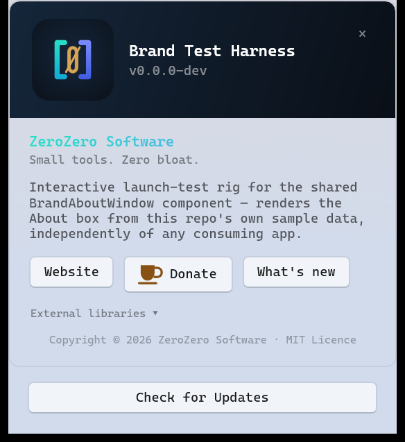
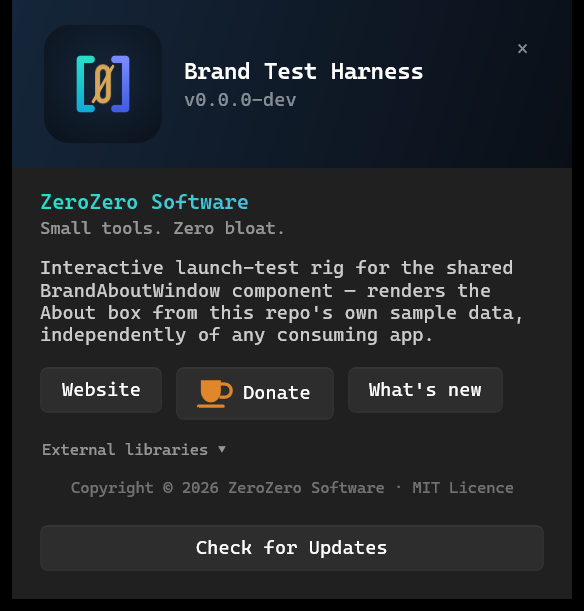
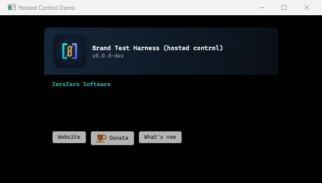
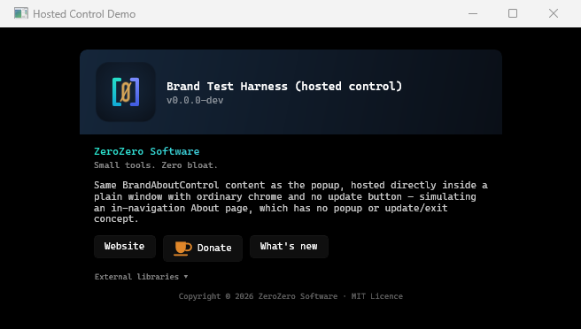

# The brand component

The studio's visual identity and About plumbing: the brand constants, one parameterised About
component with a popup window to host it, a bracket action button, the brand typeface, and the
palette as a resource dictionary XAML can merge. `ZeroZero.Brand.Core` holds the constants and the
data contracts; `ZeroZero.Brand.WinUI` holds the About control, the window, the bracket button and
the dictionary. A control with no studio identity is not here: the settings-row info bubble is the
controls foundation assembly's ([`zerozero-controls.md`](zerozero-controls.md)), so a component that
wants a bubble takes no font pack with it.

The component is versioned as `BrandVersion` in `Versions.props` and released under `brand-v<x.y.z>`
tags, with notes under `docs/release-notes/brand/`; [`releasing.md`](releasing.md) has the procedure.
The entry point is `ZeroZero.Brand.WinUI`, which brings `ZeroZero.Brand.Core` with it; a console tool
takes `ZeroZero.Brand.Core` alone.

## Requirements

| | |
|---|---|
| SDK | .NET 10 |
| `ZeroZero.Brand.Core` | Plain `net10.0` — no WinUI, no Windows-specific dependencies, safe from a console app or any other .NET target. |
| `ZeroZero.Brand.WinUI` | `net10.0-windows10.0.26100.0`, Windows 10 1809 (build 10.0.17763) or later, with the Windows App SDK. Unpackaged. |

## The assemblies

### `ZeroZero.Brand.Core`

- **`Brand`** — studio-wide constants: name, tagline, website, Buy Me a Coffee URL, GitHub org URL,
  and the brand palette as hex strings (teal / blue / purple / indigo / amber / steel blue /
  terracotta / orange, plus the two background tones). Each accent is named for the colour itself
  rather than for a job it does in one application, so a second application can take it without
  inheriting the first one's meaning.
- **`ExternalLibrary`** — a small record describing a third-party dependency to credit (name, author,
  purpose, licence, optional URL).
- **`AboutButton`** — a button of the application's own for the About row: a label, which is also
  its accessible name, and an `Action` run on every press.
- **`AboutInfo`** — the per-app data an About surface needs: app name, version, description, repo
  URL, the address its release notes are fetched from, its list of `ExternalLibrary` credits, and
  its own row buttons as a list of `AboutButton` in `Buttons`. `ReleaseNotesUrl` is optional: leave
  it unset and the built-in "What's new" button does not appear. `Buttons` is empty by default.
- **`ConsoleBanner`** — prints a plain-ASCII "about" banner to the console for non-UI (CLI) tools,
  built from an `AboutInfo`.

### `ZeroZero.Brand.WinUI`

References `ZeroZero.Brand.Core` and `ZeroZero.Win32`.

- **`BrandAboutControl`** — a `UserControl` holding the actual About *content*: the `[Ø]` studio mark
  and brand header band, the company name and tagline as plain non-interactive text, app description,
  a row of buttons, the release notes in a panel of their own, an expandable external-libraries
  credit list, and a copyright footer. The row reads Website, Donate, the built-in What's new, then
  the application's own buttons from `AboutInfo.Buttons`, each at its natural width in the row's own
  style; it wraps onto another line at narrow widths, and a hidden button takes neither width nor a
  gap. Owns no window chrome, sizing, or update/exit flow — hosts either inside `BrandAboutWindow` or
  directly inside a host app's own in-navigation page. Call `SetInfo(AboutInfo)` after construction
  to populate it (a method, not a settable property — the WinUI XAML compiler needs a parameterless
  constructor for any type exposed as a public property on a XAML class, which `AboutInfo`'s
  `required` members deliberately do not have).
- **`BrandAboutWindow`** — the shared, parameterised About popup (320 px wide, Mica backdrop, centred
  on the monitor under the cursor, no title bar, always-on-top). A thin shell hosting
  `BrandAboutControl` plus the tray-app-only "Check for Updates" button. **It closes as soon as it
  loses focus**, whatever is on screen at the time, unless a transient window of the same
  application is up; Escape and the close button take the same path.
  Its height comes from its own layout and never exceeds the monitor's work area. Takes its monitor and DPI
  metrics from the `ZeroZero.Win32` foundation assembly, so it has no dependency on a consuming
  app's own `NativeMethods` class.
- **`BrandAboutOptions`** — the parameters: an `AboutInfo`, an optional `OnCheckForUpdates` callback
  (omit it to hide the "Check for Updates" button entirely — a console-only tool or a build without
  an update channel does not pass one), and an optional `OnBeforeExit` hook for apps that need to
  self-exit cleanly before an installer-triggered relaunch.
- **`BrandBracketButton`** — a borderless action button in the brand's own shape, placed by a host on
  its own, with `BrandBracketButtonState` naming what it shows and `Symbol` the character before its
  label. See [the bracket action button](#the-bracket-action-button).
- **`BrandBracketButtonColumn`** — several of those buttons stacked, all at the width of the widest,
  so their brackets line up. See [the bracket action button](#the-bracket-action-button).
- **The brand typeface**, Cascadia Mono, with its OFL licence. Shipped as content so it travels with
  the library into every consuming app's output, and the markup asks for it at
  `ms-appx:///ZeroZero.Brand.WinUI/Assets/Fonts/CascadiaMono.ttf`. **That folder is the only one both
  reference routes produce.** Where the font lands differs between them:

  | Route | `Assets\Fonts\` at the output root | `ZeroZero.Brand.WinUI\Assets\Fonts\` |
  |---|---|---|
  | Project reference | Yes | Yes |
  | Package reference | No | Yes |

  Inside the package the font sits beside the assembly under
  `lib\<tfm>\ZeroZero.Brand.WinUI\Assets\Fonts\`, the folder a consuming WinUI build resolves a
  referenced library's assets from, and that is what fills the second column. **Nothing reports a
  font URI that resolves to no file** — the face falls back to the family name, which on a machine
  with Cascadia Mono installed is indistinguishable from success, so neither a screenshot nor a text
  measurement tells the two apart. `BrandFontPathTests` holds the URIs in the markup to the paths the
  package carries instead.

  **A publish carries the files too.** The Windows App SDK tooling copies the files a referenced
  library's `.pri` lists into a build output only, so on the package route a publish would hold
  neither file. The package therefore carries `buildTransitive\ZeroZero.Brand.WinUI.targets`, which
  adds both to the publish set at `ZeroZero.Brand.WinUI\Assets\Fonts\`, skips any path the publish
  already holds, and fails the publish with an error naming the files if the package stops carrying
  them. Measured with a scratch application on the package route, self-contained for `win-x64`: the
  build output and the publish output each hold both files, with no warning. A publish on the
  project-reference route is not measured.
- **The brand resource dictionary**, `Themes/BrandResources.xaml` — the palette and the typeface in
  the form XAML consumes. Ten colour keys, `BrandBackgroundColour`, `BrandBackgroundAltColour`,
  `BrandTealColour`, `BrandBlueColour`, `BrandPurpleColour`, `BrandIndigoColour`,
  `BrandAmberColour`, `BrandSteelBlueColour`, `BrandTerracottaColour` and `BrandOrangeColour`; a
  brush per colour, `BrandTealBrush` and so on; and `BrandFontFamily`, the brand face. Light and dark
  carry the palette unchanged, because identity does not follow the theme; high contrast resolves
  every key to the system's own window and highlight colours, because that mode exists so the user's
  choice outranks the studio's. A test holds every colour to the constant in `Brand`, so the two
  declarations cannot drift.

### The palette from XAML

Merge the dictionary once, in the application's resources, and resolve a key with `ThemeResource`. A
colour key feeds a gradient stop or code; a brush key feeds a `Foreground` or a `Background`. A merge
lower down — a window's or a page's own resources — resolves too, scoped to that subtree, which is
what the harness's palette window does and all a rig with one such window needs:

```xml
<Application.Resources>
    <ResourceDictionary>
        <ResourceDictionary.MergedDictionaries>
            <XamlControlsResources xmlns="using:Microsoft.UI.Xaml.Controls"/>
            <ResourceDictionary Source="ms-appx:///ZeroZero.Brand.WinUI/Themes/BrandResources.xaml"/>
        </ResourceDictionary.MergedDictionaries>
    </ResourceDictionary>
</Application.Resources>
```

```xml
<TextBlock Text="Broker" Foreground="{ThemeResource BrandTealBrush}" FontFamily="{ThemeResource BrandFontFamily}"/>
```

The harness renders every key under `--palette` (below), which is how a change to the dictionary is
looked at rather than read.

### What the palette measures

Every figure below is a WCAG 2.x contrast ratio, and each is pinned in
`tests/ZeroZero.Brand.Core.Tests/PaletteContrastTests.cs` — the table's rows and the two tint figures
in the prose under it alike — so editing a constant trips a test rather than moving a colour past a
floor unnoticed.

| Accent | On the brand background | On black text | On white text |
|---|---:|---:|---:|
| Teal | 11.51 | 12.58 | 1.67 |
| Blue | 7.01 | 7.67 | 2.74 |
| Purple | 6.44 | 7.04 | 2.98 |
| Indigo | 3.46 | 3.78 | 5.55 |
| Amber | 8.70 | 9.51 | 2.21 |
| Steel blue | 7.49 | 8.20 | 2.56 |
| Terracotta | 7.14 | 7.81 | 2.69 |
| Orange | 7.01 | 7.67 | 2.74 |

Two rules follow, and both are properties of the palette rather than advice.

**Text on an accent is black.** Every accent but Indigo clears 4.5:1 against black and falls short
of it against white, and Indigo is the one that runs the other way. Choosing per fill is how a
surface ends up unreadable, so a caller putting text on a brand colour uses black — or Indigo, and
white.

**A tinted fill is not derived by opacity.** Both brand grounds sit near black, so three quarters of
a low-opacity result is ground whatever is laid over it. At 24 % nothing in the palette clears
1.75:1 against its ground, and even pure white reaches only 2.17:1 — no choice of accent can produce
a distinguishable tint there. Use the solid colour where a fill has to be seen. This is a property of
the ground, not of any one colour — every accent falls short, and so does white.

Indigo is the tightest of the eight accents on both counts: the dimmest tint on either ground, and
the only accent that clears the 3:1 non-text floor without clearing 4.5:1 for body text. So the floor
the palette as a whole is held to is the 3:1 non-text figure, not 4.5:1 — Indigo sits at 3.46 on the
brand background. Steel blue, terracotta and orange all clear 4.5:1 on both brand grounds, so none of
them joined below Indigo.

**Every figure in that table is on a dark ground.** On a light window the palette's teal, amber and
orange measure between 1.5:1 and 2.7:1, so text or a glyph in one of them on a light surface needs a
darker shade; `BrandBracketButton` carries its own, listed below.

Deliberately **not** shared: each app's own update-check networking and dialogue plumbing. Only the
window chrome and layout are unified — `OnCheckForUpdates` is a plain `Func<Task<bool>>` the consumer
wires up to its own existing update flow, returning `true` when an update was applied so the window
owns the clean-exit-before-relaunch step via `OnBeforeExit`.

## Take the reference

Either route in [`consuming.md`](consuming.md) — a `PackageReference` on the studio feed, or a
`ProjectReference` on a sibling checkout carrying
`<UndefineProperties>WindowsAppSDKSelfContained</UndefineProperties>`. The reference is
`ZeroZero.Brand.WinUI`; it pulls in `ZeroZero.Brand.Core` and `ZeroZero.Win32` transitively and
ships the typeface as content, so a consumer gets the correct brand face with no extra setup, in a
build and in a publish alike. The consuming app's `app.manifest` declares `PerMonitorV2` DPI
awareness so the window renders sharp on high-DPI displays.

## Pick the hosting style

Both share the same `AboutInfo` data model — the choice is whether the consuming app has a separate
About *window* or an About *page*:

| | Tray app | Full windowed app |
|---|---|---|
| Component | `BrandAboutWindow` | `BrandAboutControl` |
| Surface | Standalone popup (Mica, no title bar, always-on-top) | Hosted inside the app's own `Page` or window |
| "Check for Updates" | Yes, via `BrandAboutOptions` | Not in the control; the page places a `BrandBracketButton` of its own |
| The application's own row buttons | `AboutInfo.Buttons`, through `BrandAboutOptions.Info` | `AboutInfo.Buttons`, through `SetInfo` |

### The tray-app popup

Open the window with data only — no per-app XAML or logic duplication:

```csharp
var options = new BrandAboutOptions
{
    Info = new AboutInfo
    {
        AppName           = "ExampleApp",
        Version           = "1.2.3",
        Description       = "What the app does.",
        RepoUrl           = "https://github.com/0z00z0/ExampleApp",
        ReleaseNotesUrl   = "https://github.com/0z00z0/ExampleApp/releases/latest/download/whats-new.txt",
        ExternalLibraries = [ new ExternalLibrary("SomeLib", "Some Author", "What it's for", "MIT", "https://...") ],
    },
    OnCheckForUpdates = async () => await ExampleApp.Services.UpdateCheckService.CheckNowAsync(...),
    OnBeforeExit      = async () => { await ExampleApp.ShutdownAsync(); return true; },
};

new BrandAboutWindow(options).Activate();
```

**The window closes when it loses focus.** There is no setting — the release-notes panel being open
does not hold it open, Escape does the same thing, and a fetch in flight is abandoned before the
window goes. Three guards keep that rule safe to state so plainly. A deactivation arriving before
the window has ever been activated is ignored, which is what stops a fast double-click on whatever
opens the window from opening and closing it in one gesture — a second click landing after the
window has already taken focus is an ordinary click away from it, and closes it. A dismissal
already under way cannot start a second one, since closing deactivates the window. And a
deactivation while a transient window of the same application is on screen is ignored, because a
window the reader asked for is not the reader looking away: pressing "Check for Updates" opens the
update window on top of this one, and without that guard this one would close under it.
`ZeroZero.Win32`'s `TransientWindows` is the count, and
[`zerozero-win32.md`](zerozero-win32.md) says what is deliberately not re-examined afterwards. An
About surface that has to stay put is a case for hosting `BrandAboutControl` in a page instead.

**The update-check contract** — both callbacks are optional:

- **`OnCheckForUpdates`** (`Func<Task<bool>>`) — wired to the consuming app's own update flow.
  Return `true` when an update was applied and the window drives the clean exit (so the installer
  can relaunch); return `false` when there was nothing to update and the window stays open.
  **Omit it entirely to hide the "Check for Updates" button** — a console-only tool, or a build with
  no update channel.
- **`OnBeforeExit`** (`Func<Task<bool>>`) — run just before an update-triggered close so the app can
  tear down cleanly; return `false` to veto the exit and keep the window open.

The window owns only chrome and layout; each app keeps its own update-check networking and dialogue
plumbing and wires it in through these two callbacks.

### Hosted in the application's own page

A full windowed app whose About is an in-navigation `Page` (not a separate popup) skips
`BrandAboutWindow` entirely and hosts the content control itself.
[`consume-brand-about-control.md`](consume-brand-about-control.md) is the same as a checklist.

**1. Add the control to the app's existing About page XAML**, in place of the bespoke layout:

```xml
<!-- The consuming app's own AboutPage.xaml -->
<Page ... xmlns:brand="using:ZeroZero.Brand.WinUI">
    <ScrollViewer>
        <brand:BrandAboutControl x:Name="About" MaxWidth="560" HorizontalAlignment="Center"/>
    </ScrollViewer>
</Page>
```

Under the settings shell the About section's `Build` returns the control alone, with no scroll
viewer of its own: the shell puts one over every page.

**2. Populate it from the app's existing brand-facts source** (whatever plays the same role as this
repository's `AboutInfo` — a `BrandInfo` static class that also feeds a CLI banner, say):

```csharp
// AboutPage.xaml.cs
public AboutPage()
{
    InitializeComponent();
    About.SetInfo(new AboutInfo
    {
        AppName           = AppBrandInfo.Product,
        Version           = AppBrandInfo.Version,
        Description       = AppBrandInfo.Description,
        RepoUrl           = AppBrandInfo.RepositoryUrl,
        ReleaseNotesUrl   = AppBrandInfo.ReleaseNotesUrl,
        ExternalLibraries = AppBrandInfo.ExternalLibraries
            .Select(l => new ExternalLibrary(l.Name, l.Author, l.Purpose, l.License))
            .ToList(),
        Buttons           = [ new AboutButton("What's new", () => new WhatsNewWindow().Activate()) ],
    });
}
```

`SetInfo` is a method rather than a settable property — call it from the hosting page's constructor
or its `Loaded` handler, after `InitializeComponent`. **Calling it again is safe and is the expected
case**: a cached in-navigation page calls it on every visit, and the control is written for that —
the built-in link handlers are wired once at construction and read the current info, the
application's own buttons are rebuilt from the info on every call, and the credit list is cleared
before every repopulate. Neither the buttons nor the credits accumulate.

**3. Delete the bespoke About view-model and layout** once the control renders correctly; keeping
both is what lets them drift. The app's own brand-facts class stays as the single source of truth —
only its *rendering* moves to the shared control, not its data.

**Notes:**

- The control inherits the host page's theme (everything but the fixed-colour brand header band
  uses `ThemeResource` brushes), so no extra theming work is needed.
- Never shows an update button of its own — there is no `BrandAboutOptions` and no update-flow
  concept at this layer. A page that wants a check for updates places a `BrandBracketButton` beside
  or under the control and drives it from its own update flow.
- The control supplies the `[Ø]` studio mark, the company name and the tagline itself, from `Brand`'s
  studio-wide constants. The row reads **Website / Donate / What's new**, then the application's own
  buttons: Website and Donate always point at the studio's own `Brand.WebsiteUrl` /
  `Brand.BuyMeACoffeeUrl`, What's new appears only with `ReleaseNotesUrl`, and everything after it
  comes from `AboutInfo.Buttons`. An application with its own What's new window leaves
  `ReleaseNotesUrl` unset and supplies an `AboutButton` instead, so the row holds one What's new.
- **The notes open in the About surface, not a browser.** Plain text, fetched only when the button is
  pressed, three seconds to answer, one attempt: while it runs the panel says it is fetching, and a
  fetch that does not answer leaves one sentence saying so. Roughly the first four thousand
  characters are read and the panel scrolls inside a fixed height. A page host closing or navigating
  away abandons a fetch in flight; a window host calls `CancelPendingFetch()` for the same reason.
  `RepoUrl` is still required and still feeds the console banner — it just no longer has a button.

## The bracket action button

`BrandBracketButton` is a borderless button in the brand's own shape, placed by a host wherever it
wants one — a "Check for updates" under the About card on a settings page, say. The logo's square
brackets stand at either end in the logo's teal-to-blue gradient, a symbol in the brand orange
leads — a `>` chevron unless the host names another — and the label follows in the brand face. It
carries its own colours and face, so it needs no merged dictionary.

**The button centres itself in the width the control is given.** The control sizes to its content,
so a host that wants it at the start of that space sets `HorizontalAlignment="Left"` on the control
itself rather than on anything inside it; setting `Center` on the control changes nothing, since
that is already where the button sits. That holds however much width the control is given: a width
imposed on the control moves the button about inside it and never stretches it — measured, and the
reason `BrandBracketButtonColumn` exists.

```xml
<brand:BrandBracketButton x:Name="UpdateButton" Label="Check for updates" Click="OnCheckForUpdates"/>
```

```csharp
UpdateButton.Label = "Checking…";
UpdateButton.State = BrandBracketButtonState.Busy;

bool available = await CheckForUpdatesAsync();

UpdateButton.Label = available ? "Update to 1.58.0" : "Up to date";
UpdateButton.State = available ? BrandBracketButtonState.Attention : BrandBracketButtonState.Success;
```

The host owns three members: **`Label`**, the text after the chevron and the accessible name;
**`State`**, a `BrandBracketButtonState`; and **`Click`**, raised by a pointer press, Enter or Space
in every state. Both properties are dependency properties, so either can be bound.

| State | Shows |
|---|---|
| `Rest` | The orange chevron and the label. |
| `Busy` | A text spinner cycling `\| / - \` in place of the chevron; the brackets breathe; no caret. |
| `Success` | The brand slashed zero in place of the chevron, teal brackets and label; no caret. Returns to `Rest` four seconds later by itself. |
| `Attention` | Amber brackets, label and caret; the caret shows dimmed at rest. Held until the host sets another state. |

**`Success` ends by itself, and the label does not.** The button returns to `Rest` after four
seconds with whatever label the host last set. A host that changes the label for `Success` watches
the state — `RegisterPropertyChangedCallback(BrandBracketButton.StateProperty, …)` — and sets its
resting label back when `Rest` arrives.

**Pointer and keyboard.** Hover spreads the brackets 3 px apart and a press closes them 2 px. Hover
and keyboard focus show a block caret after the label, blinking, in `Rest` and `Attention`; a press
holds it dimmed. Underneath is an ordinary `Button`, so Tab, Enter, Space and the system focus
rectangle are the platform's own.

**Reduced motion.** With the system's animation effects turned off, nothing blinks, spins or moves:
the brackets stay put, the caret shows steady, and the spinner is a still ellipsis. The setting is
read at every change of state, pointer or focus, and on every spinner and caret tick.

**Colour and contrast.** The button has no fill in any state, so its text sits on the surface under
it: WinUI's base window background and its default card fill over that, `#202020` and `#2b2b2b` in
dark, `#f3f3f3` and `#fbfbfb` in light — and, where the button sits in `BrandAboutWindow`, the About
popup's own Mica Alt backdrop, which in light theme renders as `#dadada`, the darkest of the three
light grounds. Dark takes the palette as it is; light takes a darker shade of each colour, same hue
and saturation, so every figure clears 4.6:1 on all three light surfaces:

| Used for | Dark | Window / card | Light | Window / card / Mica Alt |
|---|---|---:|---|---:|
| Chevron | `#e0872a` | 5.95 / 5.17 | `#895014` | 5.88 / 6.30 / 4.66 |
| Spinner, caret, `Success` label and brackets | `#27e0c8` | 9.76 / 8.48 | `#0f695e` | 5.91 / 6.34 / 4.69 |
| Slashed zero, `Attention` label, brackets and caret | `#d8a657` | 7.38 / 6.41 | `#7b571d` | 5.87 / 6.30 / 4.66 |
| Bracket gradient, lower stop | `#11a9d6` | 5.95 / 5.17 | `#0a6681` | 5.86 / 6.28 / 4.65 |

The label at rest takes `TextFillColorPrimaryBrush`. High contrast replaces every brand colour with
the system highlight colour, as `BrandResources.xaml` does.

**The symbol is the host's.** `Symbol` is one plain character in the brand face before the label —
a down arrow for a download, a cross for a stop, whatever the act is — so it takes the theme and
the scaling the rest of the button takes, which a picture would not. A chevron where the host names
none, so a button written before this is unchanged. Only `Rest` and `Attention` show it: the
spinner and the slashed zero take its place while `Busy` and `Success` are showing.

**Pick a character the face carries.** Cascadia Mono covers 1483 code points and a good many
obvious choices are not among them: `↗` and `✕` are both absent, and Windows draws an absent
character from whatever font it falls back to — a different shape and weight sitting beside a label
in the brand face. Measured as present and used by the update window: `↓`, `→`, `»`, `✓`, `×` and
the default `>`.

The same reading covers every character the About surfaces draw. All of them are in the face except
two: the close cross, now `×` (U+00D7) rather than `✕` (U+2715), and **the hot beverage on the
Donate button (U+2615), which is not in the face and still falls back.** That one is a colour emoji
and replacing it is an appearance decision rather than a typo, so it stands until someone decides
otherwise.

**One width for several buttons.** A button sizes itself to its own text and centres itself in
whatever width it is given, which leaves a stack of them at three different lengths with their
brackets nowhere near each other. `BrandBracketButtonColumn` measures the widest and lays every one
out at that width; each button then spreads its brackets to fill it and keeps its symbol and label
centred between them. The column is only as wide as that widest button, so a host centres or aligns
the whole group as one thing, and a collapsed button takes no width, no height and no spacing.
`FillsWidth` is the switch the column throws; a button placed anywhere else never sees it.

Status (2026-09-18): compiles clean in 0.9.2; first rendered in ChargeKeeper 1.58.2 with brand
0.9.1 — placement seen, states, animations, reduced motion and theme switching not yet reported.

## Screenshots

**`BrandAboutWindow`** (tray-app popup):

| Light | Dark |
|---|---|
|  |  |

**`BrandAboutControl`** hosted directly in a plain window (no popup chrome, no update button):

| Light | Dark |
|---|---|
|  |  |

Every image is the capture script's output, so it shows the surface as it actually renders rather
than what the XAML claims.

Status (2026-09-20): **not yet captured.** The close cross changed character in 0.10.0 and the
pictures are now taken in both themes, so the two that were here — captured before 0.9.0, showing
the button row as three equal columns — were removed rather than left standing for a window they
no longer match. `scripts/Capture 'About' screenshot.ps1` writes all four; it refuses a locked or
dimmed screen rather than filing a black picture, which is why they are missing.

## The harness

`src/ZeroZero.Brand.WinUI.TestHarness` is a minimal WinUI exe that opens both hosting scenarios with
this repository's own sample data, so the About content can be inspected on screen without building
or running a consuming application:

```powershell
dotnet run --project src/ZeroZero.Brand.WinUI.TestHarness
```

It opens the `BrandAboutWindow` popup ("Window Mode") alone; `--hosted` opens the plain window
hosting `BrandAboutControl` directly, with ordinary title-bar chrome and no update button ("Hosted
Control Demo"). One surface per run, because the popup closes as soon as it loses focus and a second
window opened beside it would take that focus. `--theme Light|Dark` pins the theme, `--expand` opens
the libraries list and `--news` the release notes once the window has settled, `--notes <url>` and
`--description <text>` / `--description-file <path>` replace the rig's sample data, `--anchor` opens
a small pure-white window a capture can be checked against, `--opener` replaces the launch-time
window with a button that opens it — the only way to reproduce the double-click gesture — and
`--probe <path>` writes the window's own sizing numbers and every named row's position beside the
capture. With `--mqtt` it opens the MQTT panel scenario instead, and with `--palette` the brand
resource dictionary — one window per theme, a swatch per brush key, a strip putting black and white
text on three accents and a 24 % tint of each on the brand ground, the wordmark on two colour keys and a
sample line in the brand face, every one resolved through `ThemeResource` the way a consumer
resolves them; `--probe <path>` beside it writes the colour and face that reached each element.
`--rows`, `--titlebar` and `--prompt` open the controls foundation assembly's surfaces
([`zerozero-controls.md`](zerozero-controls.md)), `--settings` the settings window shell
([`zerozero-settingsshell.md`](zerozero-settingsshell.md)), `--tray` the tray icon with its
tooltip and menu ([`zerozero-tray.md`](zerozero-tray.md)), `--update` the shared update window
([`zerozero-update.md`](zerozero-update.md)), and `--native` the Win32 layer's dialogs. One
component per run, so unrelated windows never land on top of each other. `BrandBracketButton` is
on screen only through the update window, which uses one per choice; no scenario opens it on its
own.

Two scripts under `scripts/` drive the About scenarios:

- **`Show live 'About' dialogue.ps1`** — builds the harness if its exe is missing, then launches it,
  so both windows can be inspected on screen.
- **`Capture 'About' screenshot.ps1`** — runs the harness four times, once per surface per theme,
  and writes window-only PNGs into `docs/screenshots/`: `about-window-light.png`,
  `about-window-dark.png`, `about-hosted-control-light.png` and `about-hosted-control-dark.png`,
  the four images this guide embeds. Capture goes
  through `PrintWindow` with `PW_RENDERFULLCONTENT`, so the translucent Mica backdrop resolves
  cleanly and no desktop content bleeds through. Each capture is anchored against a pure-white patch
  parked beside the window and read off the screen device context, so a dimmed or locked screen is
  refused rather than filed, and each is retried: the popup closes if anything takes focus while it
  settles, which is the window behaving correctly.
