# The update component

`ZeroZero.Update.WinUI` is the entry point: one window in the studio's own style for every step a
person sees during an update. It carries `ZeroZero.Update.Win32`, the orchestration and the
wording — the check-ask-download-verify-launch flow that hands over to the application's own
shutdown, what each outcome says as plain sentences, and the interface a surface implements to show
them. That in turn carries `ZeroZero.Update`, the flow with nothing on screen at all: the latest
GitHub release against the running version, the download into a fresh private directory, the
verification of the installer before it runs, the launch-or-refuse policy, the stale-download sweep
and the check scheduler.

`ZeroZero.Update` and `ZeroZero.Update.Win32` are plain `net10.0` and declare themselves
Windows-only; `ZeroZero.Update.WinUI` targets WinUI. `ZeroZero.Update` takes `ZeroZero.Primitives`
for the log sink and the version reader; `ZeroZero.Update.WinUI` takes `ZeroZero.Brand.WinUI` for
the bracket action button and the studio typeface, and `ZeroZero.Win32` for monitor metrics and the
count of transient windows.

The three assemblies are versioned as `UpdateVersion` in `Versions.props` and released under
`update-v<x.y.z>` tags, with notes under `docs/release-notes/update/`;
[`releasing.md`](releasing.md) has the procedure. The component releases after `primitives` and
`win32` are on the feed at the versions it references.

## Requirements

| | |
|---|---|
| SDK | .NET 10 |
| Platform | Windows. The two plain assemblies target `net10.0` and declare themselves Windows-only through `SupportedOSPlatform`, with no version. The signature check is WinVerifyTrust. |
| The application | Able to show a WinUI window, and to call the flow from the thread that owns its windows. There is no path that shows nothing but a message box: a tool with no window at all takes `ZeroZero.Update` and supplies prompts of its own. |
| The release | A GitHub release, not a draft and not a pre-release, whose tag is a plain version (`v1.2.3`), which carries an asset named exactly as `InstallerFileName` says with the version substituted, and whose body carries the installer's SHA-256 as the only *distinct* 64-digit hexadecimal token in it — one value, repeated as often as the notes like. |
| The installer | Authenticode-signed by the expected signer, per-user, and able to start while the application exits: the flow launches it without elevation and the application exits once it has started. |

## What it contains

`ZeroZero.Update`:

- **`UpdateOptions`** — everything the application supplies: the repository owner and name, the
  product name for the user agent, the running version (the entry assembly's when null), the
  expected signer, the download-directory prefix, the installer file name with `{version}` in it,
  the installer's arguments, the initial delay and the check interval, the request and download
  timeouts, the API base and the log sink. Validated when the service is built.
- **`ExpectedSigner`** — who must have signed the installer: the certificate subject, the
  thumbprints (SHA-1 or SHA-256) of the certificates accepted when the machine does not trust the
  chain, and `acceptSelfSignedSubject`, which lets the publisher name alone carry an untrusted
  chain. `Match` says whether a certificate is that signer, and why not.
- **`UpdateService`** — `CheckAsync` finds the latest release and compares it with the running
  version; `PrepareAsync` downloads the installer into a fresh directory and verifies it, and never
  runs it, taking an optional reporter the download's progress goes to; `Launch` verifies the
  prepared file again and starts it through the shell; `SweepStaleDownloads` removes download
  directories earlier runs left behind. One instance per application, owning its two HTTP clients
  for the life of the process.
- **`DownloadProgress`** — bytes received and the total where there is one, the pair a progress bar
  is drawn from. [Below](#reporting-the-download) has how often it arrives and what it does not
  report.
- **`UpdateCheckOutcome`** — what a check found, and the whole of what an application needs to
  decide what to say. `UpdateAvailable` and `UpToDate` are the two answers a release gives;
  `NoReleases` is the repository having published none; and five say the check did not get one:
  `RateLimited`, `Unreachable` (nothing answered), `TimedOut` (something is there and did not answer
  in time), `RequestFailed` (a failure status rather than a release) and `InvalidResponse` (an answer
  that is not a release this version understands). Every one carries a `Detail` sentence for a person
  to read; **none of them has to be read to tell the outcomes apart**, which is the point of there
  being eight. A cancellation the caller asked for is no outcome at all: the check throws.
- **`UpdateScheduler`** — runs a check after an initial delay and then at an interval, one at a
  time, counted from process start and never persisted: the component stores nothing.
- **`InstallerVerifier`** — the two checks below, as one call with one verdict.
- **`PublishedHash`** — the installer's SHA-256 read from the release body; `ReleaseNotesText`
  strips the notes for a dialog and leaves the hash line out; `VersionTag` reads a tag as a
  four-part version so a running `1.2.3` is not out of date against its own `v1.2.3`.
- **`GitHubReleaseSource`**, **`InstallerDownloader`**, **`DownloadDirectory`** and
  **`ShellInstallerLauncher`** — the pieces behind the service, each replaceable through an
  interface in a test.

`ZeroZero.Update.Win32`:

- **`UpdateMessages`** — every sentence the update puts in front of a person, as plain strings:
  the question's headline and body, the download's headline and the line under its bar, and one
  sentence per outcome that stops an install. Apart from any window, so a surface written outside
  this repository words an outcome exactly as the shared one does. Every refusal has a sentence of
  its own and ends the same way: the file was not run, and the release page is where to go instead.
- **`IUpdatePrompts`** — what a surface implements. Every call is awaited and does not complete
  until the person has chosen or read what it put on screen, so nothing in the flow runs behind a
  window still in front of them.
- **`UpdateFlow`** — `RunAsync(trigger)`: check, ask, prepare, launch, then call the application's
  shutdown, returning an `UpdateFlowRun` carrying the result, the check it read and the release
  where there is one. A manual run reports every outcome; a scheduled one speaks only when there is
  something to install and logs the rest; a silent one shows nothing at all, a release included,
  and hands the release back for the caller's own surface. `InstallAsync(release)` starts an update
  from a release already found, without checking again. One install at a time, and one check at a
  time: a caller arriving while a check is in flight joins it and reads its result.
  `UpdateFlowOptions.Progress` is where a host's own progress goes, alongside the window's bar.

`ZeroZero.Update.WinUI`:

- **`UpdateWindow`** — the window itself, shown one stage at a time. Frameless on a Mica backdrop,
  always on top, centred on the monitor under the cursor and sized to its own content at whatever
  scaling that monitor has. It counts itself among the application's transient windows while it is
  open, so a window beneath it that dismisses itself on focus loss stays where it is.
- **`UpdateWindowPrompts`** — the flow's prompts, driving one window from the question through the
  download to the answer. This is what an application constructs.
- **`UpdateWindowOptions`** — the application's name, the theme, and where its release notes come
  from where it keeps its own. The wording is the component's, so there is nothing else to set.

## What a person sees

One window, not several. The question, the download that follows it and the answer that follows
that are one act, so pressing "Install now" leaves the window where it is and starts the download
in it: nothing disappears and reappears in the middle of a gesture. The notice that nothing newer
exists and a check that did not complete open the same window at its last stage.

Each picture below is the capture script's output, so it shows the window as it renders rather than
what the markup claims. Every one is at 175 per cent display scaling.

Status (2026-09-20): current. Captured from the running window with the buttons at one width, each
carrying its own symbol, and the download's stop button in place.

**The question, with the release's own notes.** Three choices, one per line.

| Light | Dark |
|---|---|
| 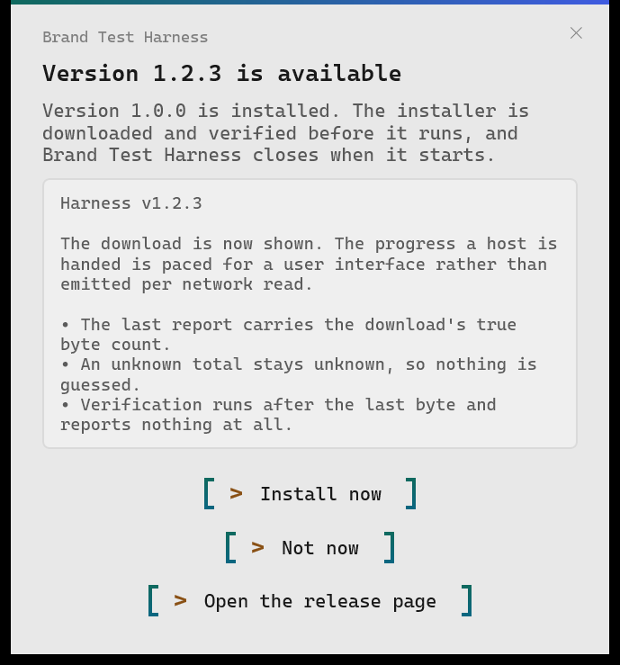 | 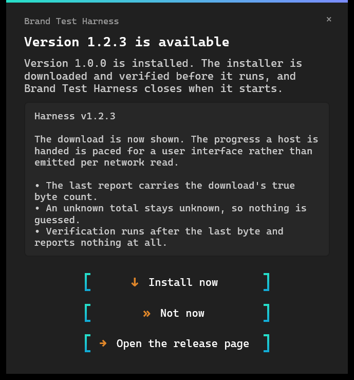 |

**The download.** The bar, the byte count, and one button that stops it. Stopping leaves nothing
behind — the partial file and the directory it was going into both go — and says nothing
afterwards: the person who stopped it knows what happened. The cross in the corner is hidden while
the download runs, so there is one way out meaning one thing.

| Light | Dark |
|---|---|
| 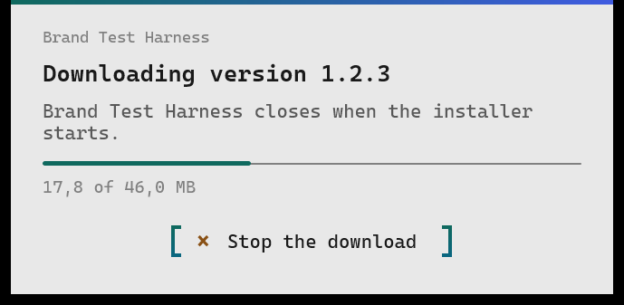 | 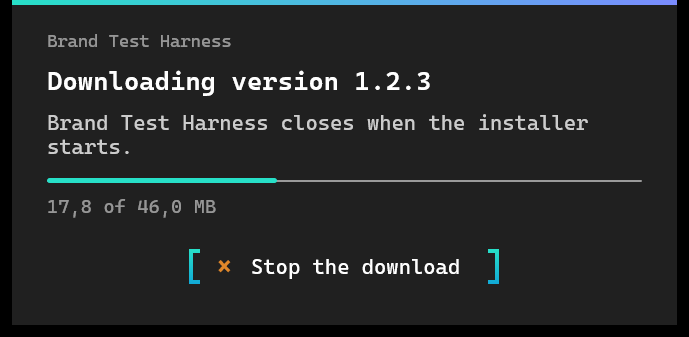 |

**The check after the last byte.** Verification reports nothing, so a bar sitting full with a byte
count still under it would read as a download that stalled; the headline and the line move instead.

| Light | Dark |
|---|---|
| 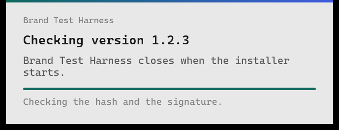 | 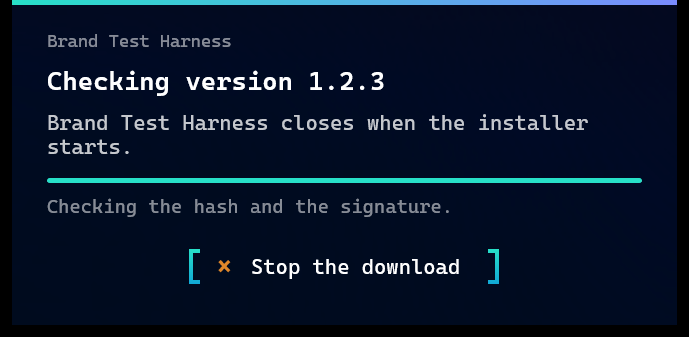 |

**A refusal**, with the verdict's own sentence and the advice every refusal ends on.

| Light | Dark |
|---|---|
| 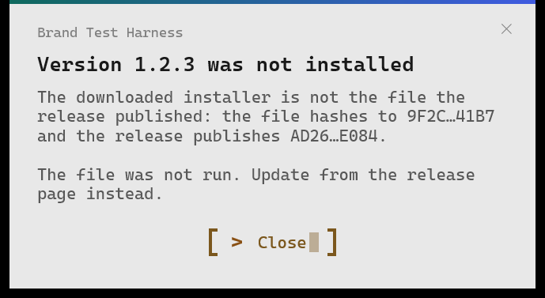 | 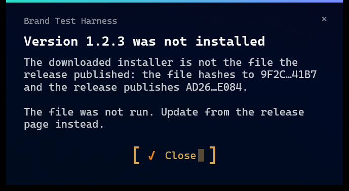 |

**An installer that would not start.**

| Light | Dark |
|---|---|
| 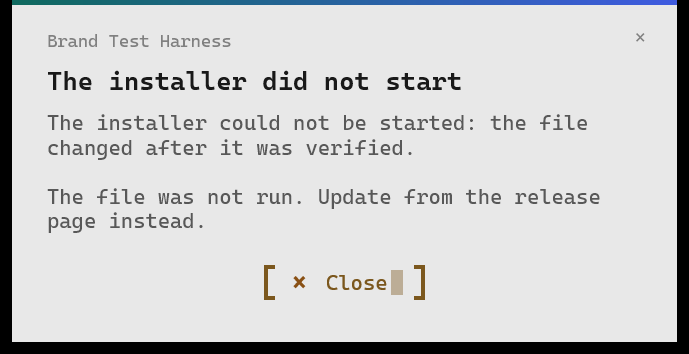 | 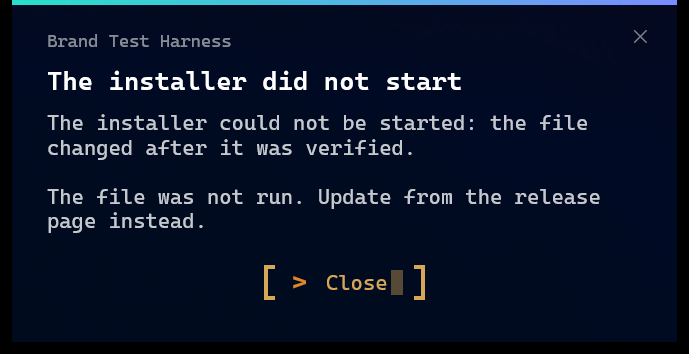 |

**Nothing newer exists.**

| Light | Dark |
|---|---|
| 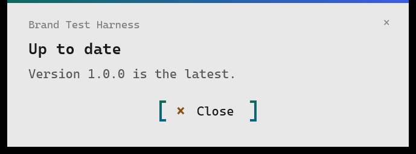 | 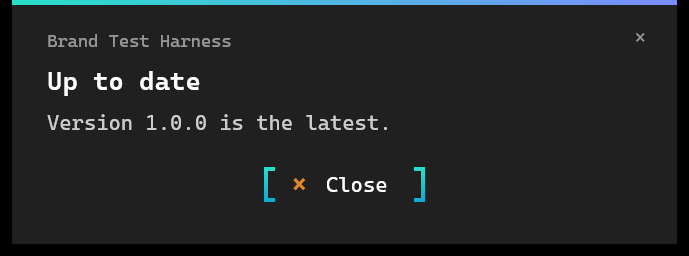 |

**A check that did not complete**, worded per outcome.

| Light | Dark |
|---|---|
| 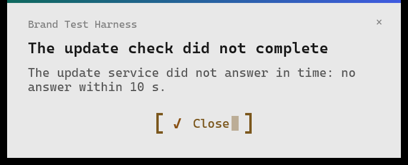 | 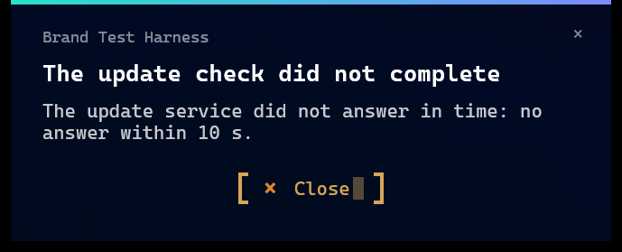 |

### A window opened on top of another

A window that dismisses itself when it loses focus — the shared About window is one — would close
the moment the update window appeared in front of it, taking half of what the reader asked for with
it. `ZeroZero.Win32`'s `TransientWindows` is a count of the application's own short-lived windows;
the update window counts itself among them for as long as it is open, and a self-dismissing window
asks `TransientWindows.AnyOpen` before dismissing. An application whose own window closes on focus
loss adds the same question to it.

A window that was deactivated while a transient was open is not re-examined when the last one
closes, so it stays open until the reader looks away again. That is the trade: a window outstaying
its welcome by one glance beats one vanishing mid-update.

### The harness

`src/ZeroZero.Brand.WinUI.TestHarness` opens the window from fabricated releases, so nothing about
its appearance has to be judged from a build:

```powershell
dotnet run --project src/ZeroZero.Brand.WinUI.TestHarness -- --update --stage question
```

`--stage` takes `question`, `download`, `verifying`, `refusal`, `failure`, `uptodate` or
`check-failed`, and opens that one stage in both themes side by side; the window shows one stage at
a time, so each costs a run of its own. `--anchor` adds the pure-white patch a capture is checked
against. `--update --silent <path>` runs the trigger that shows nothing over a service with a
release to offer, so the windows it did not open can be counted from outside, and
`--update --over-about update|plain --probe <path>` opens the About window and then a window on top
of it and records whether the one beneath dismissed itself — `plain` is the control, a window that
counts itself among nothing, which is how the measurement is known to be able to fail.

`--update --cancel person|caller --probe <path>` runs a real download off a loopback server that
promises forty megabytes and sends them slowly, presses "Install now" through the button's own
automation peer, and stops the download part-way — through the window's own button under `person`,
through the token the application passed in under `caller`. It records what the run answered and
how many download directories and files were left behind.

`scripts/Capture 'Update window' screenshots.ps1` runs the harness once per stage and writes the
fourteen pictures above into `docs/screenshots/`.

## Verification before execution

The downloaded file runs only after two checks, and each answers a question the other cannot:

1. **The SHA-256 against the hash the release publishes** — whether the download is whole. A
   truncated, corrupted or wrong file hashes differently and is refused before its signature is
   looked at.
2. **The Authenticode signature and its publisher against the expected signer** — whether the file
   is the publisher's. A file substituted for the real one, on the server or on the wire, fails
   here even when it carries a valid signature of its own, because the signer is not the one
   expected. A signed file altered after signing fails here too.

**A checksum published beside the file is not the second check.** Whatever can replace the file
can replace a hash sitting next to it, so a matching hash says only that the bytes that arrived are
the bytes that were published — nothing about who published them. Only the signature answers that,
which is why neither check can be turned off and the expected signer is the one input.

The signer check has three forms, decided by what Windows says of the certificate chain and by what
the application accepts. Under a chain the machine trusts, the subject alone must match. Under a
chain it does not trust — every machine on which a self-signed studio certificate has not been
installed — the subject must match **and** the certificate must be one the application pins by
thumbprint. The third form is the opt-in below. The verdict says which form applied.

The name is compared whole, without case, with both sides rendered through the same decoder, so
spacing and case differences between the application's string and the certificate's do not count
and a shorter name is never a match for a longer one.

### Trusting the publisher name alone

`new ExpectedSigner(subject, acceptSelfSignedSubject: true)` accepts an intact signature by the
expected subject under a chain the machine does not trust, with no pin. It is chosen per
application and off by default, so an application that does not ask for it keeps the pin
requirement exactly as it was.

What it tolerates is an untrusted root and nothing else. Every other fault the signature check
reports stops before the signer is looked at — a file altered after signing, a file with no
signature, an expired certificate, a chain that cannot be built — whatever this setting says. The
subject is compared before the untrusted chain is tolerated, so another publisher's self-signed
certificate never reaches it.

**What it knowingly accepts is a look-alike.** Anyone can mint a self-signed certificate spelling
the same name, and under this setting a file signed by one verifies. Pinning the certificate closes
that and breaks every certificate renewal; the name is the trade chosen. An application that can
carry a pin should carry one.

Revocation is a separate matter and always has been: the check asks Windows for no revocation
lookup, so a revoked certificate is refused only where Windows reports it from what it already
holds.

Verification runs twice: when the file has been downloaded, and again at the moment of launch, so
the bytes that were verified and the bytes that run are the same bytes or nothing runs. A refused
file is not run, the verdict is logged, and removing the file is attempted afterwards and separate
from the decision — it can fail, and its failure is logged rather than shown, which is why no
message claims the file was removed.

## Where the published hash comes from

The hash is read from the **release body** — the notes text the releases API returns with the
release. The body is part of the release JSON the check has already fetched, so the hash is
reachable exactly when the release is, with no second request, no separate asset and no
credential; a release whose body the updater can read is a release whose hash it can read. The
release workflow that attaches the installer writes one line in the body carrying the installer's
SHA-256, in upper or lower case, and the flow takes it.

The rule is strict: **exactly one distinct 64-digit hexadecimal token in the body**. A body with
none is `HashNotPublished` and nothing is downloaded — a file that cannot be verified is not
fetched, and the person is told the release publishes no hash. A body with two different tokens is
`HashAmbiguous` and nothing is downloaded either: which one is the installer's would be a guess. A
release that ships a second artefact publishes that artefact's hash somewhere other than the body.

Two routes were measured and not taken. A package-manager manifest attached as an asset carries
the installer's hash in its own format, but not every release of the family attaches one, and a
second download to read a hash that the first response already carries is a second thing that can
fail. A `.sha256` file beside the installer is the checksum the caveat above is about, and no
release of the family carries one.

## Wiring

Once, at start-up, on the thread that owns the windows:

```csharp
var options = new UpdateOptions
{
    RepositoryOwner = "studio",
    RepositoryName = "product",
    ProductName = "Product",
    ExpectedSigner = new ExpectedSigner("CN=Studio, O=Studio, C=NO", ["<SHA-256 thumbprint>"]),
    DirectoryPrefix = "Product-update",
    InstallerFileName = "Product-Setup-{version}.exe",
    Log = log,
};
var service = new UpdateService(options);
service.SweepStaleDownloads(TimeSpan.FromDays(1));

var prompts = new UpdateWindowPrompts(new UpdateWindowOptions { ApplicationName = "Product" });
var flow = new UpdateFlow(service, prompts, new UpdateFlowOptions
{
    Shutdown = () =>
    {
        lifecycle.MarkDeliberateExit();
        Exit();
    },
    Log = log,
});

var scheduler = new UpdateScheduler(options.InitialDelay, options.CheckInterval,
    token => RunOnTheDialogThread(() => flow.RunAsync(UpdateTrigger.Scheduled, token)), log);
scheduler.Start();
```

Which trigger a surface uses decides what reaches the screen:

| Trigger | What appears |
|---|---|
| `Manual` | Every outcome, each in the window. For a surface with nothing of its own to report on — a tray menu item. |
| `Scheduled` | Nothing, except the install question when a release is found. |
| `Silent` | Nothing at all, a release included. The run carries the result and the release, and the caller reports on its own button. |

A silent check that found something installs from the release it was handed:

```csharp
UpdateFlowRun run = await flow.RunAsync(UpdateTrigger.Silent);
if (run.Result == UpdateFlowResult.UpdateAvailable) ShowTheButton(run.Release!);
// later, when the button is pressed:
await flow.InstallAsync(release);
```

`RunAsync` continues on the caller's context after each await, so the window appears where the call
was made; the scheduler's callback runs on a pool thread, and the application marshals it to the
thread that owns its windows as the sketch shows.

**A caller arriving while a check is running joins it.** It is handed that same check and reads its
result, rather than starting a second request or being refused, so an About window opening during
the scheduled check costs nothing and cannot disagree with it. The shared slot is cleared as the
check ends, before any caller resumes, so a request arriving after that starts a fresh check. Each
surface shows its own waiting state while it waits; the component shows none. The caller that
started the check is the one whose cancellation token is inside the request.

## Reporting the download

A 64 MB installer takes long enough that a window showing nothing looks stopped. **The window draws
the bar itself**, from the same measurements, so an application that wants nothing more attaches no
reporter of its own. A reporter attached in the options is reported to as well, for an application
that also wants the download on a surface of its own — a tray tooltip, a status line.

Each report is a `DownloadProgress`: the bytes received so far, and the total where there is one.

| | |
|---|---|
| How often | At most one report every 250 ms while bytes are arriving, counted from the last report sent, whatever the file's size or the line's speed. `InstallerDownloader.ProgressInterval` is the value. |
| The last report | A download that completes always ends with one report carrying its true final byte count, whether or not the interval was due. A bar that stops a little short of its end reads as a download that stalled. |
| A failure or a cancellation | Nothing is reported after the last interval report. That report is the last real measurement and nothing follows it claiming completion or resetting to zero. |
| An unknown total | `TotalBytes` is null and `Fraction` with it. Nothing is guessed, so a surface with no total shows a marquee or a byte count rather than a percentage. |
| No reporter attached | The download is the download it was before the interval existed: no clock is read and nothing is allocated for it. |

The total is the response's `Content-Length` where the server sends one, and the size the release
declares where it does not. It is null only when neither is available.

A host that wants the download on a surface of its own attaches its reporter once, in the options,
alongside the window's own bar:

```csharp
var flow = new UpdateFlow(service, prompts, new UpdateFlowOptions
{
    Shutdown = …,
    Progress = new Progress<DownloadProgress>(p => ShowBar(p.BytesReceived, p.TotalBytes)),
    Log = log,
});
```

A host driving the service directly passes one per call instead —
`service.PrepareAsync(release, progress, token)` — and the two layers report identically, because
the flow does nothing but hand the reporter down.

**Which thread a report arrives on is the reporter's business.** A `Progress<T>` constructed on the
thread that owns the windows posts back to that thread and is the easy choice; a reporter written
by hand is called on whatever thread the download is running on and marshals itself. The download
does not wait for a report to be handled.

## What stays with the application

- **The options.** Every product string, the repository, the installer file name and the expected
  signer with its pins. The component carries none of its own.
- **The running version**, when the entry assembly is not the application — a plug-in host, a
  test — through `UpdateOptions.RunningVersion`.
- **The application name and the theme** the window takes. The wording is the component's.
- **The shutdown callback.** The flow calls it once the installer process exists and never before;
  when and how the application exits is its own decision. An application armed with the lifecycle
  component marks the exit deliberate first, or the relaunch hook starts it again under the
  installer.
- **Where the check is offered** — a menu item, the About window, both — and the thread its
  windows live on.
- **What a silent check shows.** The component shows nothing for that trigger, so the button, its
  waiting state, its label when a release is found and what it does with a failure are the
  application's.
- **A second surface for the download**, where the window's own bar is not the whole of what the
  application wants shown.
- **The release-notes text**, where the application keeps its own rather than the release body,
  through `UpdateWindowOptions.ReleaseNotes`.
- **The installer itself**: where it puts things, per-user or per-machine, elevation, and the
  step that closes a running application. The flow assumes a per-user installer that needs no
  elevation and an application that exits once the installer has started.
- **The release workflow** that signs the installer, attaches it under the expected name and
  writes its SHA-256 in the release body.

## Traps

- **The running version is the entry assembly's.** `Assembly.GetEntryAssembly()`, never the
  executing one: the executing assembly is this library once the code is shared, and its version
  would silently stand in for the application's. A host with no entry assembly, or one whose
  version is not the product's, sets `RunningVersion`.
- **Pin the next certificate one release ahead.** A certificate rotated in with the same release
  that first expects it is refused by every installed version, since none of them pins it. The
  release before the rotation carries both thumbprints. An application that accepts the publisher
  name alone has no rotation problem and no protection from a look-alike either; that is the trade,
  and it is made once, in the options.
- **A refusal says nothing about the file being gone.** Removing it is attempted after the
  decision, its failures are logged rather than shown, and a message claiming a deletion would be
  false in front of a person often enough to matter. Removal is also not all-or-nothing: the
  recursive removal of a download directory carries on past an entry it cannot take, so a failure
  can still have taken the installer with it.
- **A silent check that finds a release installs nothing.** It returns `UpdateAvailable` and the
  release; the install starts from `InstallAsync` when the person asks for it.
- **Progress stops where the download does, and the install does not.** Verification runs after the
  last byte arrives and reports nothing, so a bar that has reached its end sits full while the hash
  and the signature are checked. The window says so; a surface of the application's own that treats
  the final report as "finished" says so too early, and the flow's own result is what finished
  means.
- **Stopping the download reports nothing.** The run answers `DownloadCancelled` and no window
  says so, because the person who pressed the button already knows. An application that wants to
  say something says it itself.
- **A stopped download and a cancelled run are different answers.** The person's button answers
  `DownloadCancelled`; the token the application passed in still surfaces as an
  `OperationCanceledException`, so an application shutting down mid-download is not left reading an
  ordinary outcome and staying up.
- **A window that closes on focus loss has to be told.** The update window counts itself among the
  application's transient windows; a window of the application's own that dismisses itself on focus
  loss asks `TransientWindows.AnyOpen` before it does, or it closes the moment the update window
  appears on top of it.
- **Every prompt is awaited.** The flow does not move on while a window is still in front of a
  person, so a surface of the application's own that completes before the person has answered will
  find the update running behind it.
- **The window does not hold the caller.** The task dialogs it replaced ran on the calling thread
  and did not return until the person answered; the window does not, and the call that opens
  it returns once the window is on screen. A host that gates its own notices — one through
  at a time, the gate reopened when that call returns — reopens it the moment the window
  opens rather than when the person answers, so a second notice stacks a second window on the
  first. Await the outcome before reopening such a gate. Measured by a consuming application,
  on a tray menu reporting an update check.
- **Attaching no reporter turns off the application's own surface, not the window's.** The window
  draws its bar from the same measurements either way; the reporter in the options is a second
  place for them to go.
- **One hash in the body, the installer's.** A second distinct hash anywhere in the notes — a
  portable build's, a checksum of a checksum — makes the release un-installable through the flow.
- **The tag is a plain version.** `v1.2.3` or `1.2.3`; a pre-release suffix, a component-prefixed
  tag or a name is an invalid response, never a release.
- **The asset name must match exactly.** The first executable in the release is never taken; the
  release must carry an asset named as `InstallerFileName` says, case included.
- **The rate limit is a state, not a failure.** An anonymous request is one of sixty an hour per
  address; a manual check refused by it is told when the limit lifts, and a scheduled one logs and
  waits for the next interval.
- **Nothing is persisted**, so the interval counts from process start: an application restarted
  every hour checks every hour.
- **The asset name needs the version placeholder.** Matching is exact, case-sensitive and has no
  wildcard, so an `InstallerFileName` written without `{version}` in it searches for the same
  literal name at every release and never matches an asset whose own name carries the version.
- **A release source built outside the component needs its own user agent.** GitHub refuses a
  request that carries none; only the client the component builds sets one, so a replacement
  `IReleaseSource` supplies its own.
- **There is no path that skips the published hash.** The verifier requires one to be present in
  the release body; a release that publishes none is refused before its signature is even looked
  at.

## Take the reference

Either route in [`consuming.md`](consuming.md). The reference is `ZeroZero.Update.WinUI`; it brings
`ZeroZero.Update.Win32`, `ZeroZero.Update`, `ZeroZero.Primitives`, `ZeroZero.Brand.WinUI` and
`ZeroZero.Win32` with it. An application that wants the orchestration and a surface of its own
takes `ZeroZero.Update.Win32`, and a headless tool takes `ZeroZero.Update` alone.

The tests are in `tests/ZeroZero.Update.Tests` and `tests/ZeroZero.Update.Win32.Tests`, plain
`net10.0`, and run on Windows only. The window has none: it is proved by the harness and the
pictures above. The release server is a loopback listener that writes exactly
the status, headers and bytes each test says, so a download that ends early is a socket closing
early. The verifier is exercised against real files: copies of the assembly under test signed
through PowerShell's `Set-AuthenticodeSignature` by certificates made in the test — the expected
signer, a stranger, and an impostor spelling the expected name with a key of its own — plus the
unsigned, tampered and truncated forms; the trusted-chain form runs against the runtime's own core
library where the machine trusts its signature, and is reported as skipped where it does not. The
launcher in the tests records and starts nothing, and the sentences are read back rather than
shown. Nothing reaches the internet, no installer runs, and no window appears on screen.

Status (2026-09-20): 0.11.0's window is proved by the harness and by the fourteen pictures above,
not by tests. Three things were measured rather than reasoned about: the silent trigger over a
service with a release to offer created no visible window at any point in the run; the About window
survived an update window opening on top of it and closed under a control window that counts itself
among nothing, so the count is what does the work; and the window sized itself correctly at 175 per
cent, the scaling every picture was taken at. **100 per cent has not been seen**, because the
machine the pictures were taken on has one display and it runs at 175 per cent.

Status (2026-09-20): 0.10.0's reporting interval and its final report are proved by having been run
once, against a local server, rather than by tests of their own — the report count, their order, the
final count against the file's real length, a download with no reporter behaving as before, a report
reaching a host through the flow rather than the service, and a cancelled download sending nothing
after its last report. The two existing tests that already asserted progress still hold, because
they assert the reports are monotonic and that the last carries the whole length, neither of which
the interval changes.

What 0.9.0 added — the publisher-name-alone mode, the silent trigger, joining a
check already in flight, installing a release already found, and the host's own release-notes text —
is proved by having been run once rather than by tests of its own, and the suite covers it only
where an existing test already asserted the behaviour it replaced. One case is not proved at all: a
chain fault other than an untrusted chain, because Windows will not apply a signature with an
expired certificate and producing one would mean putting a certificate in a store. What was measured
instead is that a file altered after signing and an unsigned file both still refuse with the mode on,
and that the verifier reaches the signer check for one trust code only.
